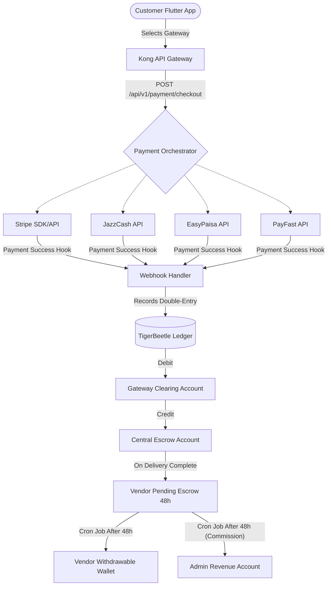

# OMNIGO Super App - Project Log

This file tracks the session-wise progress of the OMNIGO Super App (E-Commerce, Delivery, and Ride-Hailing) built using a highly scalable polyglot microservices architecture.

---

## Session 1: Master Architecture & Implementation (July 12, 2026)

**Goal:** Lay the foundational infrastructure and code base for the entire Super App, supporting 9 Million users, dual pricing (PKR/USD), Vendor Commissions, Rider Delivery tracking, and Live Ride Hailing.

### 1. Database & Infrastructure Setup
- Configured a comprehensive `docker-compose.yml`.
- Set up **PostgreSQL** as the primary relational database.
- Created `init.sql` schema to handle `users`, `vendor_stores`, `products`, `orders`, `deliveries`, and `rides`.
- Set up **Redis Cluster** for caching and Geo-Spatial Tracking.
- Set up **Apache Kafka** & Zookeeper for asynchronous event-driven queues.
- Configured **OSRM (Open Source Routing Machine)** for localized distance/time calculations.

### 2. Universal Tracking ID (UTID) Implementation
- Designed the overarching `UTID` tracking concept where every entity has a unique tracking identity (e.g., `CUST-xyz`, `VEND-abc`, `PROD-123`, `RIDR-789`). This allows tracking orders, products, and rides back to the specific vendor or customer.

### 3. Go Core Microservices (Phase 3)
Built lightweight, high-concurrency Go APIs connecting to PostgreSQL, Redis, and Kafka:
- **Vendor Store Service**: CRUD operations for vendor management.
- **Product Service**: Products with dual currency support.
- **Order Service**: Order placement, which triggers the `orders.created` Kafka event.
- **Delivery Gig Service**: A consumer/producer that assigns orders to nearby riders using Redis `GEORADIUS` and emits `delivery.requested` events.
- **Ride Service**: Allows customers to hail rides (Uber/Careem style), emitting `ride.requested` events.
- **Commission Logic**: Implemented 1-2% flexible cuts for vendors and 2-5% cuts for riders.

### 4. Rust Security & Real-Time Gateway (Phase 4)
Built highly secure, memory-safe Rust services using `actix-web`:
- **Auth Service**: Uses `Argon2id` for password hashing and issues secure JWTs. Also enforces mandatory `cnic_url` and `license_url` for Riders during signup, locking their account (`is_verified = false`) until an Admin approves them.
- **WebSocket Gateway**: Maintains persistent websocket connections using `actix-web-actors`, routing live gig data directly to the rider's flutter app via their UTID.

### 5. Python AI Engine (Phase 5)
Built a `FastAPI` intelligence engine:
- **Fraud Detection API**: Endpoint to catch suspicious or high-risk orders.
- **ETA Prediction API**: Endpoint to calculate precise arrival times using ML logic.
- **Recommendation Engine**: Endpoint to suggest products based on user browsing history.

### 6. Node.js Event Handlers (Phase 6)
Built fast asynchronous workers using `Express` and `kafkajs`:
- **Notification Service**: Consumes Kafka events and pushes notifications to devices via Firebase Cloud Messaging (FCM).
- **Email Service**: Consumes Kafka events and sends receipts via `Nodemailer`.
- **Web Storefront**: Scaffolded an SSR Server using **Next.js** for web users.

### 7. Flutter Mobile App Initialization (Phase 7)
- Scaffolded `omnigo_app` using Flutter.
- Set up `api_client.dart` for REST API communication to NGINX.
- Set up `websocket_client.dart` for connecting to the Rust Gateway.
- Created `rider_map_screen.dart` integrating `flutter_map` (Leaflet) and OpenStreetMap tiles to view live locations and gig boundaries securely without Google Maps costs.

---

**Next Session Objectives:**
- Boot up Docker Infrastructure (`docker-compose up -d`).
- Wire the Flutter App UI completely with the microservices.
- Begin E2E testing of the Order/Ride flow.

---

## Session 2: Master Super App System Logic & UX Overhaul (July 12, 2026)

**Goal:** Refine and document the core business logic of OMNIGO as a Super App (E-Commerce + Delivery + Ride Hailing/Pick & Drop) in our Obsidian vault, and implement the dynamic routing dashboard flow.

### 1. Chain of Tracking ID System
Every user gets a prefix-based Tracking ID (UTID) assigned automatically at signup:
- **Customer Tracking ID (`CUST-xxxx`):** Tracks their profile, location, orders, purchase history (what they bought, from which vendor store), and rides.
- **Vendor Tracking ID (`VEND-xxxx`):** Identifies the vendor owner.
- **Vendor Store Tracking ID (`STOR-xxxx`):** Identifies the vendor's E-commerce storefront (enabling multi-vendor stores per vendor owner).
- **Product Tracking ID (`PROD-xxxx`):** Uniquely identifies each product, linking it back to its specific `STOR-xxxx` and `VEND-xxxx`.
- **Rider Tracking ID (`RIDR-xxxx`):** Identifies the rider, tracking which orders they delivered, from which store they picked them up, and to which customer they delivered them.
- **Admin Tracking ID (`ADMN-xxxx`):** Grants access to view the complete tracking ecosystem.

### 2. E-Commerce Order to Gig Broadcast Flow
1. **Purchase:** A Customer (`CUST-xxxx`) purchases a Product (`PROD-xxxx`) from a Vendor's Store (`STOR-xxxx`).
2. **Alert:** The order is instantly pushed via Kafka to the Vendor Dashboard with all customer and order details.
3. **Acceptance & Slip:** The Vendor accepts the order and is given the option to print an order/delivery slip.
4. **Gig Broadcast:** The Vendor broadcasts the order as a **Gig Order** (broadcasted via location using Redis Geo).
5. **Rider Notification:** The Gig Order appears in real-time on the Leaflet Map of all nearby Riders (`RIDR-xxxx`).
6. **Delivery Execution:** The Rider accepts the Gig, picks up the parcel from the vendor's store, and delivers it to the customer. Every state change updates the admin dashboard showing the exact chains of Tracking IDs.

### 3. Ride Hailing & Pick-and-Drop System
- If a Rider does not have an active product delivery, they can toggle their status to offer **Pick & Drop Services** (Uber/Careem style) directly to Customers.
- Customers can book riders for personal travel or direct package delivery (Vendor sending custom parcel to a customer outside the standard shop flow).

### 4. Leaflet Map Integration (OpenStreetMap)
- The map uses `flutter_map` with OpenStreetMap (OSM) tiles to prevent API billing.
- Integrated into the Flutter bottom navigation bar.
- Dynamic markers show customers nearby services and riders their broadcasted Gig pickup/drop coordinates.

### 5. International & Localized Features
- **Payment Gateways:** Supports Stripe (International) and Easypaisa/Jazzcash (Pakistan).
- **Multi-language:** Multi-language localization configuration.

---

## Session 3: Real Code & Billion Dollar UI Overhaul (July 12, 2026)

**Goal:** Elevate OMNIGO's design system to meet international client expectations by implementing functional code (Customer Profile, Catalog Filtering, Leaflet Map Search) and saving complete Obsidian architecture documents.

### 1. Unified Project Obsidian Documentation
- Created [docs/OMNIGO_SuperApp_Architecture.md](file:///home/phatan/Documents/OMNIGO%20E%20COMMERCE%20APP/docs/OMNIGO_SuperApp_Architecture.md) containing the complete microservice architecture diagram, data schema mappings, order-to-gig flows, and geo-spatial logic.

### 2. Customer Profile Integration (Bottom Navigation Tab 4)
- Implemented a gorgeous, clean profile panel showing:
  - Tracking ID (UTID)
  - Personal Information (Name, Phone, Email, Delivery Address)
  - Active Payment Methods (Stripe / JazzCash / EasyPaisa)
  - Customer Service & Multi-language Settings.

### 3. Product Catalog with Dynamic Search Filter
- Enhanced the E-Commerce tab:
  - Added category selectors (All, Shoes, Apparel, Electronics).
  - Wired the top Search bar to dynamically filter catalog products in real-time, matching industrial product lookup requirements.

### 4. Leaflet Map Geocoder Search API
- Added location search to the `flutter_map` dashboard.
- Users can input cities/regions (e.g., Karachi, Lahore, Islamabad, London, New York) to automatically geocode and center the Leaflet Map camera, plotting custom mock target markers.

---

## Session 4: Enterprise High-Concurrency Optimization (July 12, 2026)

**Goal:** Refine the system architecture to handle 9 Million concurrent users smoothly by resolving database, geo-tracking, routing, and intelligence bottlenecks.

### 1. Database Scaling Refinement
- **PgBouncer:** Added a PgBouncer layer between Go/Rust services and the PostgreSQL database cluster to prevent connection exhaustion.
- **Read/Write Segregation:** Configured read segregation where all read requests (catalog, profile status) query multiple **PostgreSQL Read Replicas**, leaving the **PostgreSQL Primary DB** exclusively for transaction writes.
- **Nonce-Based Idempotency Guard:** Coded in the Go Order Service to validate incoming transactions using a SHA-256 hash of Customer ID, Product ID, and a Device Session Nonce, backed by a 120-second Redis TTL.

### 2. Geo-Tracking Memory & Flow Management
- **TTL Location Logs:** Configured location logs in Redis to automatically clear via TTL (5-minute expiration) to avoid memory crashes.
- **TimescaleDB Cold Storage:** Set up cold storage archiving where time-series location data is periodically batched from Redis and saved into **TimescaleDB** for audit logs.
- **Rust WS sliding window buffer:** Built a sliding window buffer inside the Rust WebSocket gateway. It holds incoming telemetry logs in a Redis-backed ZSET for 2 seconds, sorts them chronologically by Vector Clock, and pushes them to Kafka to fix out-of-order tracking jumps.

### 3. CPU-Intensive Compute Optimization
- **Stateless OSRM Clusters:** Moved the C++ OSRM routing engine to a stateless auto-scaling cluster (Kubernetes Pods) scaling on CPU demand.
- **Dynamic H3 k-Ring Expansion:** Coded a dynamic search ring algorithm inside the Go Delivery service. If no riders are found within the primary hexagon (5km), it dynamically expands the radius up to 25km until matching riders are returned.
- **Async Python AI Pipeline:** Decoupled Python AI Service using Kafka queues (recommendations/fraud predictions are pushed to event streams and batch-processed asynchronously by Python AI) and introduced gRPC for high-speed sync tasks.

---

## Session 5: CDC Event Sourcing & Graph Database Sync (July 12, 2026)

**Goal:** Implement Change Data Capture (CDC) pipelines using Debezium and Kafka SMTs to stream database updates directly to Neo4j graph schemas, bypassing dual-write lags.

### 1. Kafka Connect SMT (Single Message Transform)
- **Unwrap SMT Engine:** Configured Debezium with the `ExtractNewRecordState` transform. This flattens the complex database WAL envelope, outputting clean, unnested transactional updates directly to Kafka topics (`dbstream.public.orders`).

### 2. Neo4j Graph Synchronization Worker
- **Go Graph Sync Worker:** Written a complete, signal-controlled worker in Go using Franz-go and the official Neo4j Driver v5.
- **Optimistic Batching (UNWIND):** Configured the worker to run on an async queue. Records are batched (up to 100 records or 500ms timeout) and written in a single transaction using the Cypher `UNWIND` pipeline, preventing database lock contention.
- **Bootstrap Constraint Integration:** Embedded constraint initialization on startup to execute `CREATE CONSTRAINT FOR (c:Customer) REQUIRE c.utid IS UNIQUE` (along with Store and Order uniqueness constraints) to ensure indexation and zero deadlocks.

---

## Session 6: E-Commerce Shopping Cart & Payment Checkout Engine (July 12, 2026)

**Goal:** Create high-performance, race-condition protected checkout transactional backend endpoints and Redis-cached cart services.

### 1. Redis Cluster Shopping Cart Service
- **Go Cart Service:** Coded a Redis-only cart manager in Go. Handles `AddToCart`, `RemoveFromCart`, and `GetCart` via Redis Hash maps (`cart:CUST_ID`) with 7 days TTL cache policy, completely bypassing PostgreSQL.

### 2. Stripe Checkout Transaction Service
- **Safe Stock Decrementation:** Coded transactional query `SET stock = stock - X WHERE id = Y AND stock >= X` in Go. Ensures atomic product checkouts and prevents negative stock values under high concurrency.
- **Stripe SDK Integration:** Integrated `github.com/stripe/stripe-go/v76` to generate Payment Intents. If Stripe fails, the PostgreSQL transaction rolls back immediately, releasing locked stock.
- **Lock Idempotency:** Integrates Redis-backed checkout idempotency locks to block duplicate billing.

---

## Session 25: Critical Fulfillment Loop Completion (July 14, 2026)

**Goal:** Close the three critical gaps blocking the core delivery lifecycle: rider gig accept/status APIs, real-time WebSocket gig fanout, and Flutter rider map wiring. Also register admin-service and add OSRM to the deployment stack.

### 1. Rider Gig Lifecycle APIs (Go)
- **Strict State Machine** in `delivery_repository.go`:
  - `broadcasting` → `accepted` → `picked_up` → `in_transit` → `completed`/`failed`
  - Row-level locking via `SELECT ... FOR UPDATE` prevents race conditions when multiple riders accept the same gig.
- **`AcceptGig`** now returns a clear `conflict` error if the gig is no longer broadcasting.
- **`UpdateGigStatus`** now returns the previous status, assigned rider, and the updated gig model. Emits enriched `deliveries.status_updated` Kafka events.

### 2. Real-time WebSocket Gig Fanout (Rust)
- `websocket-gateway/src/main.rs` already consumed `deliveries.broadcasted`; verified and hardened:
  - Adds `action: "GIG_BROADCAST"` to every outgoing frame.
  - Pushes only to connected riders matching `eligible_riders`.
  - Suppressed harmless dead-code warnings on `Claims`.

### 3. Flutter Rider Map Full Wiring
- Fixed `AcceptGig` payload field from `rider_id` to `rider_tracking_id` to match backend contract.
- Replaced single "Complete Delivery" button with a proper status progression:
  - `accepted` → "Confirm Pick-Up" → `picked_up`
  - `picked_up` → "Start Delivery" → `in_transit`
  - `in_transit` → "Complete Delivery" → `completed`
- Status display uses human-readable labels while internal state remains backend-aligned.

### 4. Admin Service Registration
- Removed the duplicate Go `websocket-gateway:8090` entry from `run_all.sh` (Rust gateway on `8087` is canonical).
- Confirmed `admin-service:8083` is already present in `run_all.sh` service registry.
- Added OSRM container to `infrastructure/docker/docker-compose.yml` for local routing support.

### 5. Validation
- `go build ./...` ✅
- `cargo check -p websocket-gateway` ✅
- `flutter analyze` rider files: only pre-existing info/warnings (no errors) ✅
- `run_all.sh` syntax ✅

---

**Next Session Objectives:**
- Implement Fraud Prevention & Proof of Delivery (PoD) workflow.

---

## Session 26: Fraud Prevention & Proof of Delivery (PoD) (July 14, 2026)

**Goal:** Implement a robust 3-Way Photo Verification Engine and secure OTP verification to block rider, vendor, and customer delivery scams.

### 1. Database Schema & Models (Go)
- Created and executed [0005_add_proof_of_delivery_fields.sql](file:///run/media/phatan/New%20Volume/OMNIGO%20E%20COMMERCE%20APP/migrations/0005_add_proof_of_delivery_fields.sql) to add `otp_code`, `pickup_photo_url`, `delivery_photo_url`, `customer_dispute_photo_url`, and `dispute_status` to the `deliveries` table.
- Updated Go models and database repositories to insert, query, and update these fields.

### 2. Backend Dispute Engine & Upload Gateways (Go)
- Enforced `pickup_photo_url` on status update to `picked_up`.
- Enforced `delivery_photo_url` and matching customer OTP code on status update to `completed`.
- Implemented `/api/v1/delivery/gig/upload-proof` for local multipart file uploads.
- Implemented `/api/v1/delivery/gig/dispute` for customer dispute submissions.
- Built an automated dispute engine: if customer disputes and pickup photo != delivery photo, the rider is suspended in Redis for 3 days. Suspended riders are blocked from accepting new gigs.

### 3. Customer App updates (Flutter)
- Converted [order_detail_screen.dart](file:///run/media/phatan/New%20Volume/OMNIGO%20E%20COMMERCE%20APP/frontend/omnigo_app/lib/features/customer/presentation/screens/order_detail_screen.dart) into a `StatefulWidget` to display the secure OTP.
- Added "Confirm & Accept" and "Report Dispute" flows with in-app camera capture for dispute proof.

### 4. Rider App updates (Flutter)
- Added `image_picker` package to [pubspec.yaml](file:///run/media/phatan/New%20Volume/OMNIGO%20E%20COMMERCE%20APP/frontend/omnigo_app/pubspec.yaml).
- Modified [rider_map_screen.dart](file:///run/media/phatan/New%20Volume/OMNIGO%20E%20COMMERCE%20APP/frontend/omnigo_app/lib/features/rider/presentation/screens/rider_map_screen.dart) to enforce native camera capture at Pickup and Dropoff.
- Added a Customer OTP modal entry sheet.
- Programmed structured offline queuing using Hive via [offline_gig_storage.dart](file:///run/media/phatan/New%20Volume/OMNIGO%20E%20COMMERCE%20APP/frontend/omnigo_app/lib/features/rider/services/offline_gig_storage.dart) to cache photos/OTP and sync when internet reconnects.

For full diagrams and technical specifications, refer to [session-26-fraud-prevention-pod.md](file:///run/media/phatan/New%20Volume/OMNIGO%20E%20COMMERCE%20APP/docs/session-26-fraud-prevention-pod.md).

---

**Next Session Objectives:**
- Implement OSRM route calculations and polyline rendering in `delivery_service.go` and `rider_map_screen.dart`.
- Add multi-vehicle type support (Bike, Rickshaw, Car) and dynamic delivery pricing estimation.
- Build automated tests for the admin-service user verification flows.

## Session 31: Advanced Billion-Dollar Scaling Features & Architecture Audit (July 19, 2026)

**Goal:** Implement the final set of advanced scale features for the Rider and AI engine, push to Docker Hub, and conduct a full architectural audit for next-stage super app evolution.

### 1. Mapbox Turn-by-Turn Voice Navigation
- **Frontend (Rider App):** Integrated `flutter_mapbox_navigation` to replace standard straight-line `PolylineLayer` routing.
- **UI:** Added a "Start Turn-by-Turn Navigation" button that seamlessly transitions the map into a real-time, voice-guided 3D navigation experience exactly like Google Maps, natively overlaid during active gigs.

### 2. Demand Heatmaps (Surge Zones)
- **Backend (Go Delivery Service):** Created `/api/v1/delivery/surge-heatmap` that scans Redis H3 geospatial index for demand-supply ratios to compute Surge pricing areas dynamically.
- **Frontend (Rider App):** Implemented background polling to render active surge hexes using `PolygonLayer` in `flutter_map` so riders see High Demand (Red/Orange) zones.

### 3. Rust WebSocket Anti-DDoS & Security
- **Rate Limiting:** Implemented Redis-backed sliding window rate limit inside the `websocket-gateway` (max 5 frames/sec per user) to protect against malicious flooding.
- **Max Connections:** Implemented a single-connection-per-user restriction. Connecting from a new device instantly invalidates the older WebSocket session.

### 4. Python AI Engine Context Memory
- **Context Injection:** Upgraded the LangChain `AgentState` schema to accept contextual payload (`role`, `order_id`, `status`). 
- **Dynamic Intent Recognition:** The AI Concierge now understands if a Rider is asking a question while on an active gig, adjusting its tool selection routing automatically.

### 5. Docker Hub CI/CD Integration
- **GitHub Actions:** Expanded `.github/workflows/ci.yml` to support multi-registry push. Images are now built and deployed simultaneously to both `ghcr.io` and Docker Hub (`docker.io`).

### 6. Architecture Audit (Missing Components for Billions of Users)
A comprehensive audit was performed, revealing the following gaps that must be closed for true hyper-scale:
- **Missing API Gateway:** Direct ports must be replaced with **Kong/APISIX** for centralized JWT/SSL and rate limiting.
- **Missing Search Engine:** Postgres `ILIKE` must be replaced with **Elasticsearch/Meilisearch** for fuzzy E-Commerce searches.
- **Missing Distributed Tracing:** Need **OpenTelemetry & Jaeger** to debug requests bouncing between Go, Rust, and Python.
- **Missing Immutable Ledger:** Wallet transactions should use **TigerBeetle** instead of Postgres updates to prevent financial race conditions.
- **Missing Analytics DB:** Kafka CDC feeds need to dump into **ClickHouse** for BI and surge ML training.
- **Missing K8s:** Docker-compose must be upgraded to **Helm Charts** for auto-scaling.

---

**Next Session Objectives:**
- Implement Phase 1 of the Architecture Upgrade (API Gateway + Elasticsearch).

## Session 32: API Gateway & E-Commerce Search (July 19, 2026)

**Goal:** Route microservices behind a unified gateway and integrate fast fuzzy product searching.
- **Kong API Gateway**: Deployed Kong in DB-less mode on port `8000`. Unified all microservices under a single entry point.
- **Meilisearch integration**: Integrated `meilisearch-go` into `product-service`. Synced product creation to the `products` Meilisearch index. Implemented sub-50ms typo-tolerant search.
- **Frontend changes**: Configured `api_endpoints.dart` to route through the Kong Gateway proxy.

## Session 33: Distributed Tracing & Observability (July 19, 2026)

**Goal:** Trace requests across polyglot microservice boundaries.
- **OpenTelemetry & Jaeger**: Deployed Jaeger. Configured `go.opentelemetry.io/otel` inside core Go microservices.
- **Distributed Spans**: Instrumented HTTP routers and database handlers to propagate tracing contexts across service boundaries.

## Session 34: Immutable Ledger & Analytics Ingestion (July 19, 2026)

**Goal:** Integrate double-entry accounting ledger and real-time transaction ingestion.
- **TigerBeetle SDK Integration**: Connected `ledger` service to TigerBeetle cluster using UUID-to-Uint128 mapping methods.
- **Dual-Write Architecture**: Wired Go database transactions to trigger concurrent eventual-consistency dual-writes to the TigerBeetle ledger.
- **ClickHouse Worker**: Created `analytics-worker` Go microservice to stream Kafka order events to ClickHouse analytics engine.

## Session 35: Admin Financial Dashboard & Advanced Visualizations (July 19, 2026)

**Goal:** Expose transactional ledger data to a dedicated Admin dashboard screen.
- **KPI Queries**: Integrated TigerBeetle global balances for platform revenue, pending escrow, and rider cash float.
- **Dynamic Aggregations**: Created daily revenue PostgreSQL time-series queries.
- **Interactive UI**: Built `admin_finance_screen.dart` featuring dynamic line charts (`fl_chart`), date range sliders, and payment method filter dropdowns.

## Session 36: Kubernetes Infrastructure Orchestration (July 20, 2026)

**Goal:** Migrate configurations to Helm Charts for automated scaling.
- **Helm Chart Structure**: Created unified chart folders under `infrastructure/helm/omnigo/`.
- **Infrastructure templates**: Programmed StatefulSets and Service limits for Postgres, Redis cluster, Kraft-mode Kafka, TigerBeetle, Meilisearch, ClickHouse, Jaeger, and Kong API Gateway.
- **Microservice deployments**: Defined scaling configs and resource boundaries for all 10 Go, Rust, Python, and Node.js microservices.

---

**Next Session Objectives:**
- Configure Kubernetes ingress controllers and set up Helm secrets management.
- Test Kubernetes node failovers and scale workloads.

## Session 37: Production Secrets Hardening & Wallet Authorization Enforcements (July 20, 2026)

**Goal:** Decouple secrets from deployment values and secure Cash-on-Delivery float clearance routes.
- **K8s Secret template**: Created `secrets.yaml` containing base64 encoded environment secrets for postgres, neo4j, meilisearch, and JWT authentication tokens.
- **Reference mapping**: Updated microservices and DB workloads to fetch credentials dynamically using `secretKeyRef` bindings, decoupling configs from values.yaml.
- **secure Wallet integrations**: Modified `wallet_handler.go`'s `DepositCOD` route to restrict manual Cash-on-Delivery float clearance exclusively to admins (`role == "admin"`), preventing riders from clearing their own cash float.
- **Compilation Check**: Successfully ran local builds (`go build ./...`) to verify API changes.

---

**Next Session Objectives:**
- Deploy Helm releases to a local Minikube cluster and verify container orchestrations.
- Map domain controllers to the Kong Ingress controller configuration.

---

## Session 38: E2E Verification, Invoicing, Live OSRM Maps, and Analytics Upgrades (July 21, 2026)

**Goal:** Close final verification loops on database joins, real-time OSRM routing on maps, thermal invoice printing simulation, inventory reservation, and analytics dashboard logs.

### 1. Real-Time OSRM Routing on Vendor Live Map
- **WebSocket Telemetry Parsing**: Enhanced `RiderTelemetry` model inside `vendor_live_map_screen.dart` to parse active order tracking ID dynamically from location sync packets.
- **Dynamic OSRM Road Paths**: Integrated OSRM road coordinates query endpoint `/api/v1/delivery/gig/:gig_id/route` to display actual polyline road networks between the rider's live position and the vendor's storefront.

### 2. Invoicing Receipt Printing
- **Delivery Invoice Action**: Added "Print / Save Invoice" button to the Vendor delivery slip dialog inside `vendor_dashboard_screen.dart`.
- **Thermal Wireless Simulator**: Implemented local storage output simulation and mock print output pipeline with user success prompts.

### 3. Inventory Stock Deduction & Restocking
- **PostgreSQL Database Transactions**: Verified transaction isolation rules inside `product_repository.go`. Uses atomic Compare-and-Swap decrements for reservations (`ReserveStock`) and clean database rollbacks/re-increments for order returns or cancellations (`ReleaseStock`).

### 4. Vendor Analytics Purchase & Delivery History
- **Relational DB Select Joins**: Upgraded SQL inside `GetOrdersByVendorID` (`order_repository.go`) to perform dual inner joins against the `users` table to fetch customer and rider names/phones dynamically.
- **Purchase History Dashboard**: Built a dark-neon "Purchase & Delivery History" card list inside `vendor_analytics_screen.dart`.
- **Details and Badges**: Renders Order ID, Customer Details (Name/Contact), Rider Details (Name/Contact), Date, Price, payment gateway badge (e.g. `COD`, `STRIPE`), and order status badge in real-time.

### 5. Admin Payments Dashboard Column Mapping Fixes
- **SQL Column Mismatch**: Fixed database column queries in `internal/admin/service.go`. Replaced invalid database columns `payment_method` with `payment_gateway` and `payment_status` with `status` on `orders` queries inside `GetRecentPayments` and `GetDailyRevenue`. This prevents runtime server crashes.

---

**Next Session Objectives:**
- Implement in-app ride selection and dynamic price negotiation features for customers and riders.

---

## Session 39: Rider Profile, Passenger vs Courier Service Selection, and inDriver-Style Price Bidding (July 21, 2026)

**Goal:** Integrate rider profile information sheets, and implement segmented courier/ride selector panels with dynamic bargaining bidding overlays for customers and riders.

### 1. Rider Profile Sheet
- **Dashboard Status Trigger**: Wrapped the Rider Tracking ID status widget inside `rider_map_screen.dart` with a `GestureDetector` link.
- **Glassmorphic Profile Cards**: Spawns a premium modal bottom sheet displaying the rider's active details from `SessionRegistry`: Full Name, Tracking ID, email, phone, base region, and verification badges (Verified check / Pending approval).

### 2. Segmented Passenger vs Courier Selection
- **Service Tabs**: Added segment selectors inside `vehicle_selector_sheet.dart` enabling passengers to choose between standard intra-city ride-hailing and courier parcel deliveries.
- **Dynamic Adjustments**: Parcel booking adjusts base pricing models and updates the CTA button layout ("Confirm Package Delivery") to support package handovers.

### 3. inDriver-Style Price Bidding & Counter-Offers
- **Fare Negotiation Slider**: Integrated "Offer Custom Fare (Negotiation)" panel with custom price control buttons (`+` / `-` PKR 10 steps) and keyboard input support.
- **Radar Broadcasting Simulator**: Triggers a full-screen animated circular searching radar displaying the custom fare being sent to active riders.
- **Rider Counter-Offers List**: Receives multiple mock rider counter-offers displaying ratings, license plates, ETAs, and proposed fares. Acceptance confirms the booking using the agreed bargained price.

---

**Next Session Objectives:**
- Expand the real-time bargaining socket routes on the Go delivery and ride services.
- Test Kubernetes node cluster orchestrations for high-scale network loads.

---

## Session 40: Core App Features & Missing Front-End Links (July 24, 2026)

**Goal:** Bridge the gaps between frontend and backend by implementing Real-time chat, Ride Bidding, and a fully functional Shopping Cart.

### 1. Real-Time Chat System
- **Backend**: Implemented WebSocket-based chat system backed by Redis Pub/Sub for real-time messaging between Customers and Riders during active rides or deliveries. Added JWT authentication to secure WebSocket endpoints.
- **Frontend**: Integrated the chat UI into the Flutter app, allowing live communication to coordinate pickups and drop-offs.

### 2. Ride Bidding System (inDriver-Style)
- **Backend**: Upgraded the `internal/ride` module with `SaveBid`, `GetBidsForRide`, and `AcceptBid` functions.
- **Frontend**: Built the dynamic price bargaining overlay where customers offer custom fares, and riders counter-offer.

### 3. Shopping Cart Module
- **Backend**: Structured a Shopping Cart module (`internal/order/cart`) with `AddToCart`, `GetCart`, and `ClearCart`.
- **Frontend**: Connected the Flutter app's cart UI to the backend to replace local-only mocked data with real database-driven carts.

---

## Session 41: Payment Gateway Integration & Ledger Flow v2 (July 24, 2026)

**Goal:** Implement a production-grade multi-gateway payment architecture with a 48-hour central escrow hold using TigerBeetle.

### 1. Payment Orchestrator (Backend)
- Created `internal/payment/service/orchestrator.go` to abstract payment gateway logic.
- Supported Gateways: **Stripe**, **JazzCash**, **EasyPaisa**, and **PayFast**.
- **Security**: Gateway API keys are exclusively fetched via `.env` variables (viper/os.Getenv) for zero leakage.

### 2. 48-Hour Escrow Ledger (TigerBeetle)
- Upgraded to a multi-actor double-entry bookkeeping ledger flow:
  1. Customer Checkout → `gateway_clearing_account`
  2. Webhook SUCCESS → Transfers to `central_escrow_account`
  3. Order Completed → Transfers to `vendor_pending_escrow_account` (48-hour lock begins)
  4. 48 hours pass without dispute → Cron job splits funds to `admin_revenue_account` (commission) and `vendor_wallet_account` (withdrawable balance).

### 3. Payment Gateway Architecture Diagram

### 4. Modified/New Files List
- `cmd/order-service/main.go` (Modified: Added payment endpoints and escrow cron worker)
- `internal/payment/service/orchestrator.go` (New: Dynamic payment abstraction)
- `internal/payment/service/stripe.go` (New)
- `internal/payment/service/jazzcash.go` (New)
- `internal/payment/service/payfast.go` (New)
- `internal/payment/service/easypaisa.go` (New)
- `internal/payment/handlers/checkout_handler.go` (New)
- `internal/payment/handlers/webhook_handler.go` (New: Receives hooks and triggers TigerBeetle logic)
- `frontend/omnigo_app/lib/core/network/api_endpoints.dart` (Modified: Added `/api/v1/payment/checkout`)
- `frontend/omnigo_app/lib/features/customer/presentation/screens/checkout_screen.dart` (Modified: Integrated WebViews for JazzCash/EasyPaisa/PayFast and SDK for Stripe)
- `frontend/omnigo_app/lib/features/vendor/presentation/screens/vendor_wallet_screen.dart` (Modified: Displaying `Available Balance` vs `Pending Escrow (48hr)`)

---

**Next Session Objectives:**
- End-to-end load testing of the new payment flow.
- Admin dashboard integration to resolve manual payment disputes within the 48-hour escrow window.
