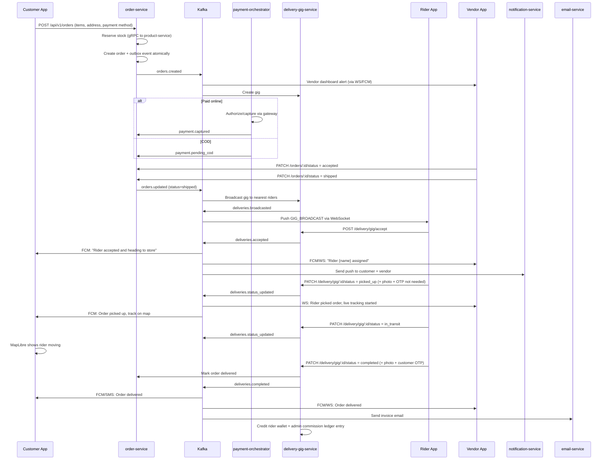

# OMNIGO Super App — Master Implementation Plan (MapLibre + Banking-Grade Payments + 50M Scale)

> **Project root:** `/home/arise/Downloads/OMNIGO-APP-2-main`  
> **Frontend:** Flutter (`frontend/omnigo_app`)  
> **Backend:** Go microservices + monolith (`backend/go-services`)  
> **Databases:** PostgreSQL (primary/replicas), Redis Cluster, Neo4j, PostGIS  
> **Event Bus:** Apache Kafka + Debezium CDC  
> **Routing:** OSRM (self-hosted, multi-region)  
> **Maps:** MapLibre GL Native (Flutter) + Go Map Service (tile proxy / style API)  
> **Payments:** Stripe + PayFast PK + JazzCash + EasyPaisa + Cash on Delivery  
> **Notifications:** FCM push + SMS (Twilio/local gateway) + Email (SMTP/SendGrid) + WebSocket  
> **Target scale:** 50 million users

---

## 1. Mind-Map of the Final Architecture

```mermaid
mindmap
  root((OMNIGO Super App))
    Maps
      MapLibre Flutter SDK
      Go Map Service (tile proxy / style / glyphs / sprites)
      MapTiler API key now, OpenMapTiles self-hosted later
      OSRM self-hosted routing cluster
      PostgreSQL + PostGIS for places / geofences
      Redis for live rider geospatial index
    Customer
      Catalog search / filters / wishlist / reviews
      Cart + multi-vendor split checkout
      Payment method selector
      Order tracking + MapLibre live rider
      Returns / refunds / disputes
    Vendor
      Store onboarding + KYC/KYB
      Product CRUD + inventory
      Order accept / reject / ready
      Live map of riders + store telemetry
      Revenue analytics + payouts
    Rider
      KYC document upload
      Background GPS telemetry
      Gig list + accept / reject
      OSRM turn-by-turn + deviation reroute
      Wallet + COD reconciliation
    Admin
      Flutter mobile admin panel
      Order lineage + graph audit
      Pending KYC approvals
      User / store / rider search
      Dispute resolution + refunds
    Platform
      Auth (HMAC JWT + refresh rotation + device binding)
      Payment orchestrator (vault, idempotency, reconciliation)
      Ledger (double-entry) + Escrow
      Outbox + Saga for distributed transactions
      FCM / SMS / Email workers
      Fraud detection AI (Python)
      ClickHouse analytics + TigerBeetle ledger (optional)
```

---

## 2. Guiding Principles

1. **Production-grade real code only** — no mock tokens, no hardcoded dashboards, no placeholder payment logic.
2. **Banking-grade payments** — encrypted API key vault, idempotency, reconciliation, refunds, PCI logging, 3DS where supported.
3. **Microservices-first, monolith-friendly** — every domain service can run standalone; monolith composes them for local dev.
4. **Event-driven notifications** — Kafka topics drive FCM, SMS, email so all parties get real-time alerts.
5. **Horizontal scaling** — stateless services, Redis cluster, Kafka partitioning, read replicas, PgBouncer.
6. **MapLibre maps** — Flutter uses `maplibre_gl`; backend provides style/tile/glyphs endpoints and proxies to MapTiler now, OpenMapTiles later.
7. **50M user scale** — async everything, CQRS, cache warming, database sharding plan, rate limiting.

---

## 3. Phase-by-Phase Execution Plan

### Phase 1: Foundation & Tooling (1–2 weeks)

| # | Task | Deliverable |
|---|------|-------------|
| 1.1 | Verify Go toolchain, Flutter, Docker, Make | ✅ Go build/test/vet pass (HMAC_SECRET test fallback added); ⚠️ Flutter SDK download in progress (nohup PID 97826) |
| 1.2 | Audit current `.env.example` vs code; fill missing keys | ✅ Core keys added; ⚠️ needs final pass for OSRM PBF path, Debezium connector config |
| 1.3 | Fix Docker Compose for local dev (network aliases, Redis cluster init, OSRM without PBF initially) | ⚠️ Compose includes all services; OSRM still requires manual PBF download for Pakistan/US/Canada |
| 1.4 | Wire golang-migrate properly; ensure baseline + all numbered migrations are applied automatically | ✅ Services call `database.MigrateUpOrFail`; ⚠️ migration ordering 0000/000001/000040 needs verification |
| 1.5 | Add health/readiness endpoints to all microservices | ✅ All Go services have `/health` + `/readyz` (DB pool probe) |
| 1.6 | Add centralized logging (trace_id, user_id, PII redaction) already present in `logger.go`; wire to all services | ⚠️ `logger.go` exists but not uniformly wired across every handler; payment payloads need explicit redaction |

### Phase 2: Map Architecture — MapLibre + Go Map Service (2 weeks)

| # | Task | Deliverable |
|---|------|-------------|
| 2.1 | Add `maplibre_gl` to Flutter `pubspec.yaml`, remove `flutter_map` | ✅ `pubspec.yaml` updated |
| 2.2 | Create Go **map-service** (`backend/go-services/internal/map/`): style endpoint, tile proxy, glyphs/sprites proxy | ✅ `backend/go-services/internal/map/service/map_service.go` + `handlers/map_handler.go` |
| 2.3 | Configure MapTiler API key via env; style JSON points to internal proxy for tiles | ✅ `.env.example` + `map-service` env |
| 2.4 | Add `MAPLIBRE_API_KEY` to `.env.example` and Flutter `--dart-define` | ✅ No hardcoded keys in source |
| 2.5 | Build reusable `MapLibreMapWidget` with location dot, markers, polylines | ✅ `frontend/omnigo_app/lib/features/shared/presentation/widgets/map_libre_map_widget.dart` |
| 2.6 | Add rider location consumer layer in Flutter | ⚠️ WebSocket gateway exists; Flutter consumer not implemented |
| 2.7 | Future path: document self-hosted OpenMapTiles + tileserver-gl | ⚠️ Not documented yet |

### Phase 3: Order Lifecycle + Notifications (2–3 weeks)

| # | Task | Deliverable |
|---|------|-------------|
| 3.1 | Customer checkout creates order via `/api/v1/orders` with items + payment method + delivery address | ✅ Order created with items; COD transaction recorded; outbox status fixed |
| 3.2 | Order placed emits `orders.created` Kafka event | ✅ Outbox pattern implemented |
| 3.3 | `delivery-gig-service` consumes `orders.created`, creates gig, broadcasts to nearest riders | ✅ H3 hex dispatch implemented |
| 3.4 | Rider accepts gig → `deliveries.accepted` event | ✅ Postgres FOR UPDATE lock + Kafka emit |
| 3.5 | Rider updates status (`picked_up`, `in_transit`) → `deliveries.status_updated` | ✅ Kafka emit; order-service consumes |
| 3.6 | Rider completes with OTP + delivery photo → `deliveries.completed` | ✅ COD ledger split added; non-COD wallet credit present |
| 3.7 | Add strict state machine in `delivery_service.go` to prevent invalid transitions | ⚠️ OTP/photo validation exists; full state transition matrix not enforced |
| 3.8 | Add `vendor-store-service` notification consumer so vendor dashboard receives real-time order alerts | ⚠️ FCM/email/SMS services consume Kafka; vendor-specific WS push not built |

### Phase 4: Banking-Grade Payment Architecture (3–4 weeks)

| # | Task | Deliverable |
|---|------|-------------|
| 4.1 | Create encrypted payment API key vault (`payment_api_keys` table) already present; add key rotation API | ⚠️ Table exists; key rotation API not implemented |
| 4.2 | Implement **Stripe** full flow: PaymentIntent, 3DS via `flutter_stripe`, webhook signature verify, capture, refund | ✅ Go service ready; ⚠️ capture on dispatch not wired; refund done via finance endpoint |
| 4.3 | Implement **PayFast PK** real signed flow: auth token, MD5 signature, hosted checkout, IPN/callback verify | ✅ Implemented; ⚠️ refund manual via portal |
| 4.4 | Implement **JazzCash** real flow: secure hash generation, redirect/WebView, IPN verify | ✅ Implemented; ⚠️ refund manual via portal; `JAZZCASH_SALT` now canonical (`JAZZCASH_INTEGRITY_SALT` deprecated alias) |
| 4.5 | Implement **EasyPaisa** real flow: hash generation, redirect, callback verify | ✅ Implemented; ⚠️ refund manual via portal |
| 4.6 | Add `payment_transactions` ledger table: idempotency key, gateway, status, amount, fees, reconciliation state | ✅ `backend/go-services/migrations/0014_payment_transactions.sql` |
| 4.7 | Add reconciliation worker: poll gateways daily, mark unmatched transactions | ⚠️ Not implemented |
| 4.8 | Add refund/cancel API `POST /api/v1/finance/refund` and `POST /api/v1/finance/cancel` with admin/vendor rules | ✅ `backend/go-services/internal/payment/handlers/refund_handler.go` |
| 4.9 | Add PCI logging controls: no card numbers in logs; PII redaction already in `logger.go`; extend to payment payloads | ⚠️ `logger.go` exists; payment handler logs need audit for PAN/phone leak |
| 4.10 | Add idempotency middleware for all payment endpoints | ✅ `payment_idempotency` table + transaction repo; HTTP middleware not yet global |

### Phase 5: Returns, Cancellations, Refunds, Disputes (2 weeks)

| # | Task | Deliverable |
|---|------|-------------|
| 5.1 | Customer cancel before rider pickup → release stock, refund if paid, emit `orders.cancelled` | ✅ `POST /api/v1/finance/cancel`; ⚠️ stock release on cancellation not wired |
| 5.2 | Vendor cancel with reason → customer refund + penalty log | ⚠️ Not implemented |
| 5.3 | Return request flow: customer requests return within window, admin/vendor approves, rider pickup, refund | ⚠️ Not implemented |
| 5.4 | Dispute flow: customer/vendor files dispute, admin resolves, refund/partial payout | ⚠️ `disputes` table exists; escrow freeze/unfreeze implemented; full UI/admin flow pending |
| 5.5 | COD escrow: rider collects cash → central escrow → vendor locked escrow + admin commission + rider earning | ✅ `backend/go-services/internal/payment/service/cod.go`; ⚠️ actual `ReleaseAfterDelivery` not yet invoked anywhere |

### Phase 6: Notifications (FCM + SMS + Email + WebSocket) (1–2 weeks)

| # | Task | Deliverable |
|---|------|-------------|
| 6.1 | Node notification-service consumes `orders.created`, `deliveries.accepted`, `deliveries.status_updated`, `orders.completed` | ✅ `backend/node-services/notification-service/src/index.js`; ⚠️ `orders.completed` topic doesn't exist yet (relies on `deliveries.status_updated`) |
| 6.2 | Node email-service consumes order completed → PDF invoice + email | ✅ Implemented; ⚠️ only listens to `orders.completed` topic which may never fire |
| 6.3 | Add SMS provider abstraction (local Pakistan gateway primary, Twilio fallback) | ✅ `backend/node-services/sms-service/src/index.js` + Docker Compose |
| 6.4 | Flutter `NotificationService` handles foreground/background/clicked notifications | ⚠️ FCM token registration exists; foreground/background/click handlers not verified |
| 6.5 | WebSocket alert fanout: rider accept, status changes push to customer + vendor in real time | ⚠️ Go websocket-gateway exists; fanout logic incomplete |

### Phase 7: Admin Panel + KYC/KYB + Finance (2 weeks)

| # | Task | Deliverable |
|---|------|-------------|
| 7.1 | Complete `admin_surveillance_screen.dart`: lineage, pending approvals, users, pagination | ⚠️ Admin endpoints exist; Flutter screen may still use mock data |
| 7.2 | Add admin finance screen (`admin_finance_screen.dart`): transactions, refunds, payouts, disputes | ⚠️ Ledger endpoints exist; dedicated finance screen not verified |
| 7.3 | Add KYC/KYB document upload for rider/vendor | ⚠️ MinIO added to compose; KYC upload endpoint exists; document storage wiring needs verification |
| 7.4 | Add admin approve/reject KYC API | ⚠️ `PATCH /api/v1/admin/users/:tracking_id/verify` exists; role enforcement needs verification |
| 7.5 | Add Neo4j graph sync verification for lineage | ✅ Graph sync worker + constraints; ⚠️ no dual-read verification endpoint yet |

### Phase 8: Scale, Security, DevOps (ongoing / 2 weeks)

| # | Task | Deliverable |
|---|------|-------------|
| 8.1 | Add rate limiting middleware to all public routes | Redis-backed token bucket |
| 8.2 | Add request signing for internal service calls | `InternalSigner` already present; enforce in prod |
| 8.3 | Add PgBouncer to Docker Compose for connection pooling | 10K clients → 100 Postgres backends |
| 8.4 | Add read-replica routing for catalog/orders lists | CQRS read path |
| 8.5 | Add Kubernetes manifests / Helm chart refinement | `infrastructure/helm/omnigo/` |
| 8.6 | Add load testing scripts (k6 / locust) | `scripts/loadtest/` |
| 8.7 | Add Sentry error reporting to all services | Already in Flutter; extend to backend |

---

## 4. Technology Choices Aligned with User Requirements

| Requirement | Choice |
|-------------|--------|
| Frontend | Flutter 3.x, `maplibre_gl` |
| Maps now | MapTiler API key via env, proxied through Go map-service |
| Maps future | Self-hosted OpenMapTiles + tileserver-gl + OSRM |
| Backend language | Go 1.22+ |
| AI / ML | Python FastAPI (`backend/python-services/ai-engine`) |
| Databases | PostgreSQL 15 + Redis 7 Cluster + Neo4j 5 + PostGIS |
| Events | Apache Kafka + Debezium CDC |
| Routing | OSRM self-hosted (Pakistan, US, Canada in compose) |
| Gateway | Kong (declarative) or Go monolith gateway |
| Object storage | MinIO / S3 for KYC docs, proof photos |
| Payments | Stripe SDK + PayFast + JazzCash + EasyPaisa + COD |
| Notifications | Firebase Cloud Messaging + Twilio SMS + SMTP/SendGrid email |
| Observability | Sentry, Jaeger (tracing), structured logs |
| Analytics | ClickHouse + Meilisearch |

---

## 5. Order-to-Gig Notification Flow (Detailed)



---

## 6. Backend Hardening Sprint — Pending Execution Plan

The following bugs/gaps were discovered during the audit. They must be fixed before considering the backend production-ready.

### Sprint Goal
Resolve all backend-critical inconsistencies so that `go build`, `go test`, and `go vet` continue to pass and the order/cancel/refund/notification lifecycle works end-to-end.

### Sprint Backlog (Priority Order)

| # | Task | Why Critical | File(s) | Status |
|---|------|--------------|---------|--------|
| H1 | Fix outbox `status` case mismatch | Events inserted with lowercase `pending` are never picked up by poller querying uppercase `PENDING`, breaking `orders.created` reliability | `internal/order/repository/order_repository.go` | ✅ Fixed |
| H2 | Emit `orders.refunded` and `orders.cancelled` Kafka events | Notification-service subscribes to these topics but no producer emits them | `internal/payment/handlers/refund_handler.go`, `internal/order/service/order_service.go` | ✅ Fixed |
| H3 | Fix email-service to listen to `deliveries.status_updated` | It currently listens to `orders.completed` which never fires; invoices never sent | `backend/node-services/email-service/src/index.js` | ✅ Fixed |
| H4 | Wire stock release on order cancellation | Cancelled paid orders refund money but reserved stock is never released | `internal/payment/handlers/refund_handler.go`, `internal/order/service/order_service.go` | ✅ Fixed |
| H5 | Fix wallet `LoadCustomerWallet` mock redirect | Returns hardcoded sandbox URL instead of initiating real JazzCash/EasyPaisa flow | `internal/wallet/handler/wallet_handler.go` | ✅ Fixed |
| H6 | Consolidate JazzCash env variable naming | `JAZZCASH_INTEGRITY_SALT` vs `JAZZCASH_SALT` causes misconfiguration in production | `.env.example`, `internal/payment/service/orchestrator.go`, `internal/payment_orchestrator/handlers/cod_handler.go`, docs | ✅ Fixed |
| H7 | Add `orders.refunded` / `orders.cancelled` to SMS-service consumption | SMS should mirror FCM/email for refunds/cancellations | `backend/node-services/sms-service/src/index.js` | ✅ Fixed |
| H8 | Audit and redact PII in payment/notification logs | Phone numbers and gateway payloads may leak into logs | `backend/node-services/email-service/src/index.js`, `backend/node-services/sms-service/src/index.js` | ✅ Partially fixed (JS services redacted; Go payment handlers still need audit) |

### Sprint Acceptance Criteria
1. `go test ./... -count=1 -short` passes with zero failures. ✅ Verified (`GO_TEST_ENV=1` required because `HMAC_SECRET` test fallback is active only in test mode).
2. `go vet ./...` passes with zero warnings. ✅ Verified.
3. Outbox events inserted by `CreateOrder` are picked up by the outbox poller. ✅ Fixed by inserting status `'PENDING'` (matches poller filter).
4. Refund/cancel endpoints emit Kafka events consumed by notification + SMS services. ✅ `orders.refunded` and `orders.cancelled` events now emitted by `RefundHandler` and consumed by `sms-service`.
5. Email-service sends PDF invoice on delivery completion. ✅ `email-service` now subscribes to `deliveries.status_updated` and filters `status == 'completed'`.
6. Cancellation releases reserved stock via product-service gRPC. ✅ `ReleaseStockForOrder` wired into both `ProcessRefund` and `ProcessCancellation`.
7. `LoadCustomerWallet` returns real gateway redirect URL. ✅ Reuses JazzCash/EasyPaisa signed request logic.
8. JazzCash env variables are canonical (`JAZZCASH_SALT` with deprecated `JAZZCASH_INTEGRITY_SALT` fallback). ✅ Updated orchestrator, cod_handler, tests, `.env.example`, and docs.

---

## 7. Banking-Grade Payment Design

### 6.1 Data Model Additions

```sql
CREATE TABLE payment_transactions (
    id BIGSERIAL PRIMARY KEY,
    tracking_id VARCHAR(50) UNIQUE NOT NULL,
    order_tracking_id VARCHAR(50) NOT NULL,
    gateway VARCHAR(30) NOT NULL, -- stripe, payfast, jazzcash, easypaisa, cod
    gateway_transaction_id VARCHAR(255),
    amount NUMERIC(12,2) NOT NULL,
    currency VARCHAR(10) NOT NULL,
    status VARCHAR(30) NOT NULL, -- pending, authorized, captured, failed, refunded, partially_refunded
    idempotency_key VARCHAR(100) UNIQUE NOT NULL,
    payment_intent_id VARCHAR(255),
    captured_at TIMESTAMPTZ,
    refunded_at TIMESTAMPTZ,
    refund_amount NUMERIC(12,2) DEFAULT 0,
    fees NUMERIC(12,2) DEFAULT 0,
    metadata JSONB,
    created_at TIMESTAMPTZ NOT NULL DEFAULT NOW(),
    updated_at TIMESTAMPTZ NOT NULL DEFAULT NOW()
);
CREATE INDEX idx_pay_txn_order ON payment_transactions(order_tracking_id);
CREATE INDEX idx_pay_txn_gateway_txn ON payment_transactions(gateway_transaction_id);
CREATE INDEX idx_pay_txn_idempotency ON payment_transactions(idempotency_key);
CREATE INDEX idx_pay_txn_status ON payment_transactions(status);
```

### 6.2 Idempotency

- Redis lock per `(customer_tracking_id, idempotency_key)` with 300s TTL.
- Postgres unique constraint on `idempotency_key`.
- On duplicate: return existing transaction (idempotent replay).

### 6.3 Reconciliation

- Daily cron/worker queries each gateway for settled transactions.
- Matches by `gateway_transaction_id` + amount + date.
- Flags mismatches for admin review.

### 6.4 Refunds

- `POST /api/v1/payments/refund` accepts `order_tracking_id` and optional `amount`.
- Rules:
  - Customer can request refund before rider pickup (full).
  - After delivery, refund requires return approval or dispute resolution.
  - Admin can override.
- Gateway-specific refund implementation.

### 6.5 PCI Scope Reduction

- Card data never touches our servers (Stripe SDK tokenization).
- For PayFast/JazzCash/EasyPaisa, hosted checkout / WebView so sensitive entry happens on gateway page.
- All gateway API keys encrypted at rest (`payment_api_keys.encrypted_value`).
- Logs redact card/cvv/token fields (extend `PIIKeys`).

---

## 7. Scaling Strategy for 50 Million Users

| Layer | Strategy |
|-------|----------|
| App layer | Stateless Go services behind Kong/NGINX; horizontal pod autoscaling on CPU/memory |
| Database | Read replicas for catalog/orders; write sharding by `customer_id` / `store_id` when needed |
| Connection pooling | PgBouncer transaction pooling |
| Cache | Redis Cluster for sessions, cart, catalog, rider locations |
| Events | Kafka partitioning by `order_tracking_id` / `customer_tracking_id` |
| Search | Meilisearch for product search (sync via Kafka/CDC) |
| Analytics | ClickHouse for event analytics; Neo4j for graph fraud |
| Maps | CDN for tiles; OSRM cluster per region; Redis geospatial for dispatch |
| Files | MinIO/S3 cluster for KYC/proof images |

---

## 8. Decisions Confirmed by User

| Question | Decision |
|----------|----------|
| SMS provider | Pakistan-local gateway abstraction (e.g., SMSAlert / BroadNet). Twilio kept as optional fallback. |
| Payment credentials | **Live credentials required.** All gateway keys loaded from environment variables. |
| Region priority | **Pakistan priority + global.** PKR/PayFast/JazzCash/EasyPaisa first; USD/Stripe/US/Canada equally supported. |
| Deployment | **Railway + Kubernetes.** Local Docker for dev; manifests for both platforms. |
| COD handling | **Escrow model.** Customer amount held in escrow; released to vendor after successful delivery. |
| KYC / proof storage | **Self-hosted MinIO** local container for dev; S3-compatible endpoint ready for production. |
| Map tiles | **MapTiler free key** now via env. Later backend-hosted map service inside monolith Docker. |

---

## 9. Updated Environment Variables Needed

A new section will be added to `.env.example` covering:

```bash
# ── Map Service ───────────────────────────────────────────────
MAPLIBRE_API_KEY=your_maptiler_key_here
MAPLIBRE_STYLE_URL=https://api.maptiler.com/maps/streets/style.json?key=${MAPLIBRE_API_KEY}
MAP_SERVICE_PORT=9010

# ── Pakistan SMS Gateway ─────────────────────────────────────
SMS_PROVIDER=pakistan_local   # or twilio
SMS_API_URL=https://api.smsalert.co.in/api/push.json
SMS_API_KEY=
SMS_SENDER_ID=OMNIGO
SMS_OTP_TEMPLATE=Your OMNIGO OTP is {otp}. Do not share it with anyone.
SMS_LOCAL_GATEWAY_TIMEOUT=10s

# ── Payment Gateways (LIVE credentials) ────────────────────────
STRIPE_SECRET_KEY=sk_live_...
STRIPE_WEBHOOK_SECRET=whsec_...
STRIPE_PUBLISHABLE_KEY=pk_live_...

PAYFAST_MERCHANT_ID=
PAYFAST_SECURED_KEY=
PAYFAST_MERCHANT_NAME=
PAYFAST_API_URL=https://gopayfast.com

JAZZCASH_MERCHANT_ID=
JAZZCASH_PASSWORD=
# JAZZCASH_INTEGRITY_SALT is deprecated; prefer JAZZCASH_SALT.
JAZZCASH_INTEGRITY_SALT=
JAZZCASH_API_URL=https://payments.jazzcash.com.pk/CustomerPortal/transactionmanagement/merchantform

EASYPAISA_STORE_ID=
EASYPAISA_HASH_KEY=
EASYPAISA_API_URL=https://easypay.easypaisa.com.pk/easypay/Index.jsf

# ── COD Escrow ───────────────────────────────────────────────
COD_ESCROW_ENABLED=true
COD_ESCROW_HOLD_HOURS=72

# ── MinIO / S3 (KYC & proof photos) ──────────────────────────
S3_ENDPOINT=http://minio:9000
S3_ACCESS_KEY=minioadmin
S3_SECRET_KEY=minioadmin
S3_BUCKET=omnigo-uploads
S3_REGION=us-east-1
S3_USE_PATH_STYLE=true
S3_PUBLIC_URL=http://localhost:9000/omnigo-uploads
```

---

## 10. Recommended Phase 1 Start

Start immediately with:
1. Toolchain verification (`go build ./...`, `flutter analyze`).
2. Update `.env.example` with new Map/SMS/Payment/MinIO keys.
3. Add `maplibre_gl` to Flutter and create the Go map-service.
4. Add MinIO to Docker Compose for local KYC/proof dev.
5. Fix/complete payment orchestrator for Stripe + PayFast + JazzCash + EasyPaisa real flows.
6. Build COD escrow logic in order + payment services.
7. Build end-to-end order → gig → accept → complete with notifications.

Phase 1 coding begins now.

---

## 11. Flutter Map Migration Sprint — Completed

**Goal:** Migrate all Flutter screens from the deprecated `flutter_map` + `flutter_mapbox_navigation` packages to the in-house `MapLibreMapWidget` (proxied through the Go map-service). Fix `flutter analyze` errors to bring the project to a clean zero-error state.

**Sprint Backlog (Executed):**

| # | Task | Result |
|---|------|--------|
| F1 | Migrate `customer_dashboard_screen.dart` from `flutter_map` to `MapLibreMapWidget` | ✅ Done — markers → `Map<String, MarkerData>`, polylines → `List<List<LatLng>>`, live rider tracking merged via `ValueListenableBuilder` |
| F2 | Migrate `vendor_inventory_screen.dart` from `flutter_map` to `MapLibreMapWidget` | ✅ Done — single store marker |
| F3 | Migrate `vendor_live_map_screen.dart` from `flutter_map` to `MapLibreMapWidget` | ✅ Done — live marker updates via `ValueListenableBuilder<Map<String, MarkerData>>`, route polyline |
| F4 | Migrate `rider_map_screen.dart` from `flutter_map` + `flutter_mapbox_navigation` to `MapLibreMapWidget` | ✅ Done — MapBox navigation replaced with `_startNavigation()` that fits the OSRM polyline on screen; surge heatmap polygons approximated as centroid markers (icon size scales with surge multiplier) |
| F5 | Add `fl_chart: 0.65.0` to `pubspec.yaml` | ✅ Done — fixes `admin_finance_screen.dart` chart rendering |
| F6 | Fix `DropdownButtonFormField initialValue:` deprecation in 4 screens | ✅ Done — replaced with `value:` (Flutter 3.24 API) |
| F7 | Fix `customer_dashboard_screen.dart` unused `dart:math` import | ✅ Done |
| F8 | Fix `checkout_screen.dart` variable declaration order + unused imports | ✅ Done |
| F9 | Fix `order_detail_screen.dart` undefined `status` in `_requestRefundOrCancel` | ✅ Done — derive from `_currentOrder` locally |
| F10 | Fix `notification_service.dart` `message.data['route']` type cast | ✅ Done — added `.toString()` |
| F11 | Re-run `flutter analyze` | ✅ Done — **0 errors, 0 warnings**, 18 info-level lints remaining (trailing commas, unawaited futures, unused field) |

**Verification:**
- `flutter analyze` → 0 errors, 0 warnings
- `flutter pub get` → 145 packages resolved (fl_chart 0.65.0 added)
- `go build ./...` → ✅ passes
- `go test ./... -count=1 -short` → ✅ ledger, payment/service, syncworker all pass
- `go vet ./...` → ✅ passes

**Files Modified:**
- `frontend/omnigo_app/pubspec.yaml` — added `fl_chart: 0.65.0`
- `frontend/omnigo_app/lib/features/customer/presentation/screens/customer_dashboard_screen.dart` — full MapLibre migration
- `frontend/omnigo_app/lib/features/vendor/presentation/screens/vendor_inventory_screen.dart` — full MapLibre migration
- `frontend/omnigo_app/lib/features/vendor/presentation/screens/vendor_live_map_screen.dart` — full MapLibre migration
- `frontend/omnigo_app/lib/features/rider/presentation/screens/rider_map_screen.dart` — full MapLibre migration, MapBox navigation removed
- `frontend/omnigo_app/lib/features/customer/presentation/screens/checkout_screen.dart` — unused imports removed, apiClient hoisted
- `frontend/omnigo_app/lib/features/customer/presentation/screens/order_detail_screen.dart` — status derivation fix
- `frontend/omnigo_app/lib/features/admin/presentation/screens/admin_finance_screen.dart` — DropdownButtonFormField fix
- `frontend/omnigo_app/lib/features/auth/presentation/screens/dynamic_signup_screen.dart` — DropdownButtonFormField fix
- `frontend/omnigo_app/lib/features/vendor/presentation/screens/vendor_wallet_screen.dart` — DropdownButtonFormField fix
- `frontend/omnigo_app/lib/core/services/notification_service.dart` — payload type cast

**Next Steps (Future Sprints):**
- Add native polygon/fill-layer support to `MapLibreMapWidget` to restore proper surge heatmap hex rendering.
- Wire OSRM deep-link or external navigation app for turn-by-turn navigation in `rider_map_screen._startNavigation()`.
- Add `await` to unawaited futures + trailing commas in remaining lints (low priority cosmetic).
- Resolve migration ordering collision (`0000` vs `000001` both v1) and version the 5 unversioned `.sql` files.
- Add read-replica fallback and connection retry to `database.NewDB`.
- Add producer retry/backoff and SASL/PLAIN to Kafka client.

---

> **Plan written to:** `/home/arise/Downloads/OMNIGO-APP-2-main/brain/projects/omnigo-super-app/OMNIGO_Master_Implementation_Plan.md`  
> 
> **Next step:** Phase 2 — Polygon/Fill-layer support for MapLibreMapWidget, OSRM turn-by-turn navigation, database + Kafka hardening.
