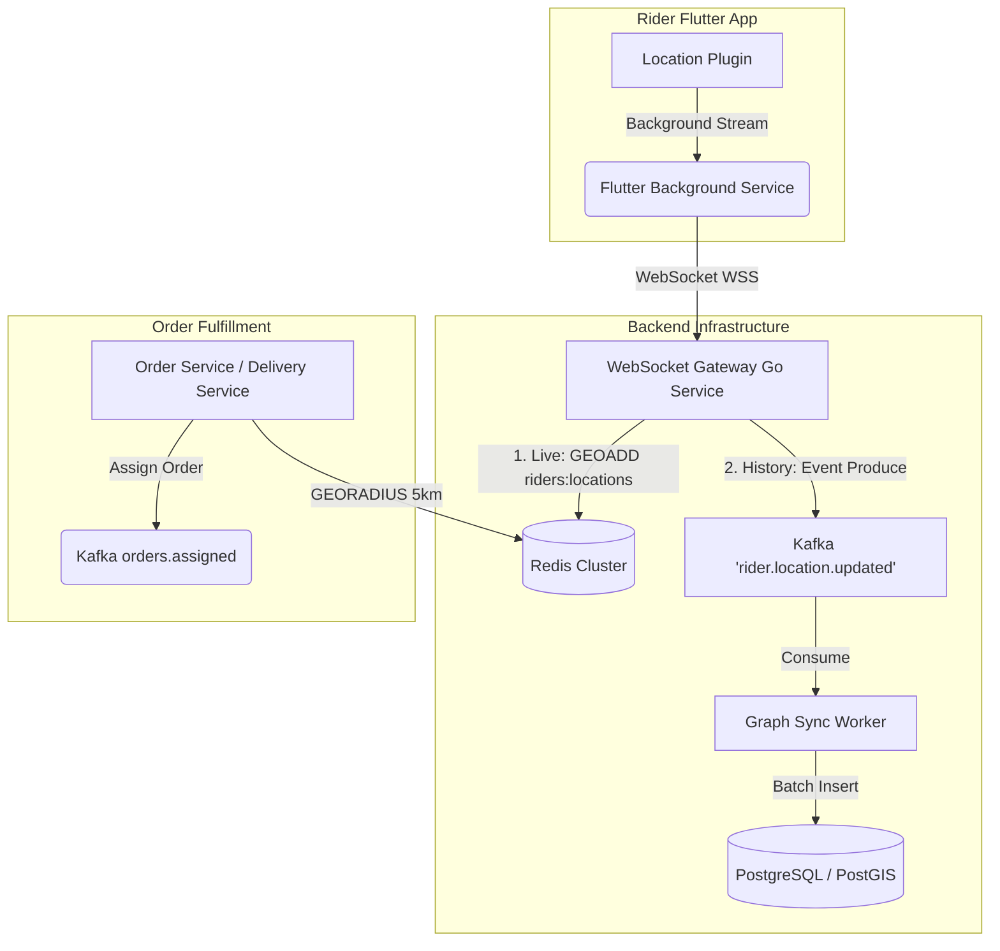

# OMNIGO Super App Architecture

This document serves as the master architectural memory for the OMNIGO Super App, capturing what has been implemented and the upcoming scaling strategies.

---

## ✅ Phase 6: Distributed Transaction Integrity (Completed)

To achieve "billion-dollar industry level" scale, we successfully replaced brittle API requests and flat database structures with a robust, event-driven, and ACID-compliant distributed transaction core.

### 1. Order Line-Item Freezing
- **Previous**: Orders relied on an array of string IDs (`product_tracking_ids`). If a vendor changed a product price later, historical orders would appear corrupted.
- **Current Architecture**: The `order_items` table was introduced. At checkout, the precise snapshot of `quantity` and `price_at_checkout` is frozen atomically. 

### 2. Optimistic Concurrency Control (CAS)
- **Problem**: Flash sales and high traffic could cause inventory race conditions (overselling).
- **Architecture**: `product-service` now exposes a synchronous internal `ReserveStock` API. It uses the Check-And-Set (CAS) database pattern: `UPDATE products SET stock = stock - qty WHERE stock >= qty`. This guarantees atomic precision without distributed locks.

### 3. Saga Checkout Orchestrator & Outbox Pattern
- **Orchestrator**: `order-service` operates as the Saga Coordinator. It issues the synchronous `ReserveStock` call to `product-service` and recalculates the grand total on the secure backend.
- **Outbox Pattern**: Orders, line items, and the Kafka event payload (`orders.created`) are inserted in the exact same Postgres transaction. A background Goroutine Poller reliably reads pending events and pushes them to Kafka.
- **Compensating Transactions**: If order insertion fails, `order-service` fires a `ReleaseStock` command back to `product-service`.

---

## 🚀 Phase 7: Event-Driven Telemetry & Rider Geospatial Updates (Planning)

The next step is to optimize the **Rider Tracking** system to drastically reduce battery drain and backend database load, upgrading the system for real-time fleet surveillance.

### Goal
Eliminate periodic HTTP polling and replace heavy PostgreSQL querying with a Hybrid Geospatial Architecture:
- **Redis**: In-memory hyper-efficient indices for live fleet tracking (sub-millisecond queries).
- **PostGIS**: Permanent storage for historical geofencing, rider payouts, and route analytics.

### Architecture Diagram

### Components of Phase 7:
1. **Persistent Telemetry (`flutter_background_service`)**: The Rider app will run a headless background task streaming coordinates even when minimized or device is locked.
2. **WebSocket Gateway**: A lightweight Go service to handle high-throughput, bidirectional connections from thousands of riders simultaneously. It employs a **Dual-Write Architecture**:
   - Updates Redis using `GEOADD`.
   - Pushes an event to Kafka for historical tracking.
3. **Redis Geospatial Indexing (Live Search)**: 
   - Proximity search: `GEORADIUS riders:locations <target_long> <target_lat> 5 km`
4. **PostGIS (Historical Storage)**: `graph-sync-worker` batches Kafka events into the `rider_location_history` table using `GEOGRAPHY(Point)` data types to provide robust route analytics without affecting live read/write latency.
