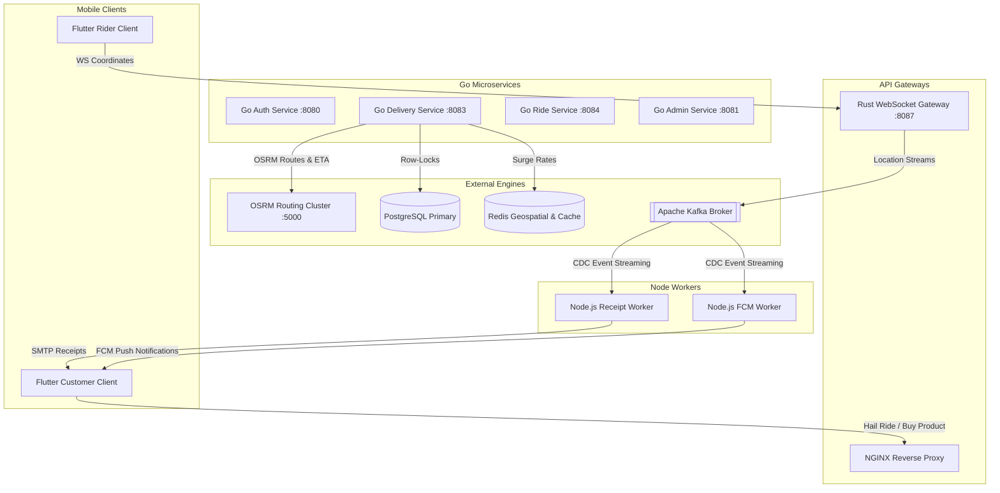

# OMNIGO Super App — Master Architecture V2 (Enterprise Features)

> **Revision:** July 13, 2026
> **Vault Reference:** [[OMNIGO_SuperApp_Architecture]]
> **Focus:** OSRM Routing, Surge Pricing, Node Event Workers, and Admin KYC Engines

---

## 📐 Expanded System Architecture

---

## 📦 Operational Subsystems

### 1. Advanced Rider Routing (OSRM Integration)
- **Engine:** OSRM (Open Source Routing Machine) running stateless driving profile.
- **Workflow:** 
  - `delivery-gig-service` fetches coordinate matrices.
  - Matches pickup (`vendor_store`) and drop (`customer`) coordinates.
  - Returns exact GeoJSON polyline geometry, distance in meters, and travel duration.
- **Caching:** Rust WS Gateway caches the active polylines in dynamic local DashMaps to eliminate duplicate lookup latency.

### 2. Dynamic Surge & Multi-Vehicle Pricing
- **Formula:**
  $$\text{Fare} = \left(\text{BaseFare} + (\text{Distance} \times \text{PerKmRate}) + (\text{Duration} \times \text{PerMinRate})\right) \times \text{SurgeMultiplier}$$
- **Surge Factors:** Calculates ride density in target H3 resolution-5 hexagons. If Rider-to-Customer ratio drops below $1.0$, it automatically injects a $1.2\times$ to $2.0\times$ multiplier.

### 3. Asynchronous Node.js Workers
- **FCM Notification Worker:** Uses a Node.js event listener on `kafkajs`. Listens for updates and triggers pushes via `firebase-admin`.
- **Nodemailer Receipts Worker:** Generates standard HTML receipt slips, bundles dynamic order details, compiles a PDF invoice, and sends via SMTP server.

### 4. Admin KYC Verification
- **Process:** Admin reads pending rider signups. Approving updates `is_verified = true` in PostgreSQL, instantly triggering a Kafka event to open their WS connection.
