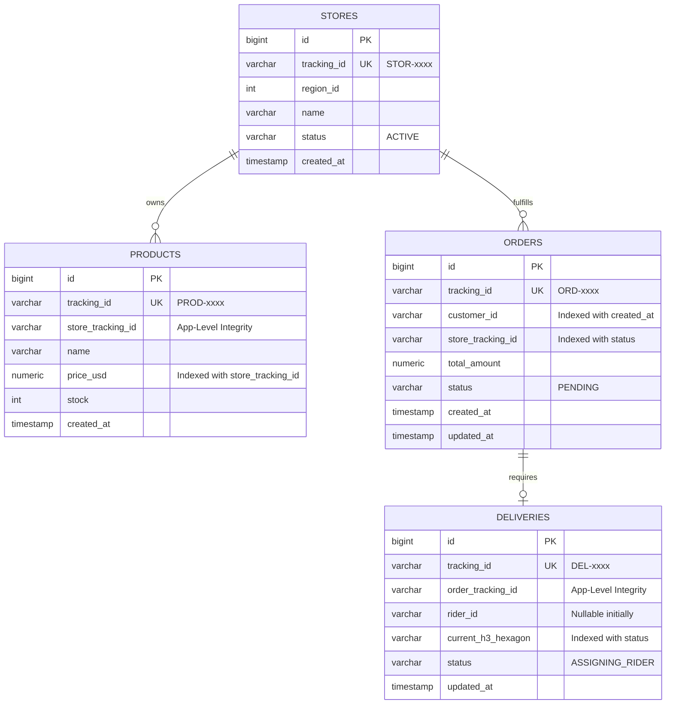

# OMNIGO Super App - Database Architecture

> [!TIP]
> **Obsidian Compatibility:** This document uses standard Mermaid.js syntax. You can copy and paste the code blocks below directly into any Obsidian note, and they will render as interactive diagrams.

## 1. High-Level Database & Scaling Architecture
This diagram illustrates how connections are pooled via PgBouncer, how CQRS handles replication lag via Redis, how data is horizontally sharded, and how Debezium CDC syncs the relational data to the Neo4j Graph database.

```mermaid
flowchart TD
    %% Define Node Styles
    classDef client fill:#2D3748,stroke:#4A5568,color:#fff,stroke-width:2px;
    classDef api fill:#3182CE,stroke:#2B6CB0,color:#fff,stroke-width:2px;
    classDef db fill:#38A169,stroke:#2F855A,color:#fff,stroke-width:2px;
    classDef cache fill:#DD6B20,stroke:#C05621,color:#fff,stroke-width:2px;
    classDef stream fill:#D69E2E,stroke:#B7791F,color:#fff,stroke-width:2px;
    classDef graph fill:#805AD5,stroke:#6B46C1,color:#fff,stroke-width:2px;

    %% Client & API Layer
    Users("📱 Customers & Vendors (50M+)"):::client
    Admins("🕵️ Admins (Surveillance Dashboard)"):::client
    GoGateway("🚀 Go Microservices Layer\n(CQRS, gRPC Mesh, Hashing)"):::api
    AdminEngine("🛡️ Admin Surveillance Engine\n(Go Service - Port 8090)"):::api
    
    Users -- "REST / WebSocket" --> GoGateway
    Admins -- "GET /api/admin/lineage" --> AdminEngine

    %% Connection Pooling
    PgBouncer("🛡️ PgBouncer\n(Transaction Pooling)"):::api
    
    %% Redis Cluster Layer
    subgraph RedisCluster [Cache & Ephemeral Data]
        RedisNode1("Redis Node 1\n(Active Eviction)"):::cache
        RedisNode2("Redis Node 2\n(TTL: Rider H3)"):::cache
    end

    %% PostgreSQL Sharding Layer
    subgraph PostgresShards [PostgreSQL OLTP]
        subgraph Shard1 [Shard 01: Orders / Users]
            PG1_P[("Primary DB")]:::db
            PG1_R[("Read Replica")]:::db
            PG1_P -. "Async Replication" .-> PG1_R
        end
        subgraph Shard2 [Shard 02: Products / Stores]
            PG2_P[("Primary DB")]:::db
            PG2_R[("Read Replica")]:::db
            PG2_P -. "Async Replication" .-> PG2_R
        end
    end

    %% Routing
    GoGateway -- "Write (CQRS) & Cache Warmup" --> RedisCluster
    GoGateway -- "Read (Lag Shield)" --> RedisCluster
    GoGateway -- "Pool Connections" --> PgBouncer
    
    PgBouncer -- "Hash: customer_id" --> PG1_P
    PgBouncer -- "Hash: store_id (Uniform)" --> PG2_P
    PgBouncer -- "Reads" --> PG1_R
    PgBouncer -- "Reads" --> PG2_R

    %% CDC Pipeline
    Debezium("⚙️ Debezium CDC\n(Logical Decoding)"):::stream
    Kafka("📨 Apache Kafka\n(Event Sourcing)"):::stream
    
    PG1_P -- "WAL Logs" --> Debezium
    PG2_P -- "WAL Logs" --> Debezium
    Debezium -- "Publish Events" --> Kafka

    %% Graph DB Sync
    GoWorker("🔄 Graph Sync Worker\n(Idempotent UNWIND)"):::api
    Neo4j[("🕸️ Neo4j Graph DB\n(Relations & Recommendations)")]:::graph

    Kafka -- "Consume Events" --> GoWorker
    GoWorker -- "MERGE Queries" --> Neo4j

    %% Admin Surveillance Lookups
    AdminEngine -- "Flat Joins (Relational Audit)" --> PgBouncer
    AdminEngine -- "Cypher Graph Queries (Topological)" --> Neo4j
```

---

## 2. Entity Relationship (ER) Diagram
This diagram outlines the primary relational DDL schema (PostgreSQL) for Stores, Products, Orders, and Deliveries.



---

## Key Architectural Notes for Obsidian

> [!IMPORTANT] System Integrity & Deadlock Prevention
> - **Idempotency**: The `Graph Sync Worker` strictly uses `MERGE` statements in Neo4j. If Kafka duplicates an event during a network retry, Neo4j will not create duplicate nodes, ensuring perfect sync integrity.
> - **No Foreign Keys (App-Level Integrity)**: High-concurrency flash sales cause `ShareLock` contention on referenced parent rows if SQL `REFERENCES` are used. Foreign Keys have been explicitly removed. Referential integrity is verified entirely at the Go Application Layer before insertion, preventing catastrophic deadlocks.

> [!WARNING] Data Skew Prevention (Sharding)
> - **Uniform Consistent Hashing**: Sharding on geographic regions (`region_id`) leads to severe data skew (hotspots) in dense cities. To ensure even load distribution, databases are sharded using `hash(customer_id)` and `hash(store_id)` via a consistent hashing ring.

> [!WARNING] Cache Stampede Prevention
> - **Active Cache Eviction**: Passive TTLs (e.g., 5 seconds) on Order caches can cause massive cache misses (Stampedes) during flash sales when the timer expires. Instead, read caches are actively evicted/updated by background Kafka workers immediately after the PostgreSQL transaction commits.

> [!IMPORTANT] Admin Surveillance Network
> - **Unified Master Tracking**: The `Admin Surveillance Engine` performs highly concurrent dual-reads. It executes "Flat Joins" against PostgreSQL Read Replicas (via PgBouncer) for transactional details, and simultaneously executes Cypher queries against Neo4j to validate topological data chains (`Customer -> Order -> Store`). Any discrepancy immediately triggers a fraud/desync alert.

> [!TIP] Microservices Protocol: gRPC vs REST
> - **Internal Mesh**: All Go microservices communicate with each other internally using **gRPC (Protocol Buffers) over HTTP/2**. This provides binary-fast serialization, highly multiplexed connections, and strict type safety compared to JSON REST.
> - **External Client Facing**: The Flutter app communicates with the edge layer via REST and WebSockets (via the Rust Gateway).

> [!TIP] Scaling Metrics
> - **PgBouncer**: 10,000 active client connections multiplexed into 100 backend PostgreSQL connections.
> - **Redis Cache TTL**: Cart items survive for 7 Days (Evicted via LRU), Rider coordinates exist strictly for 60 seconds.
