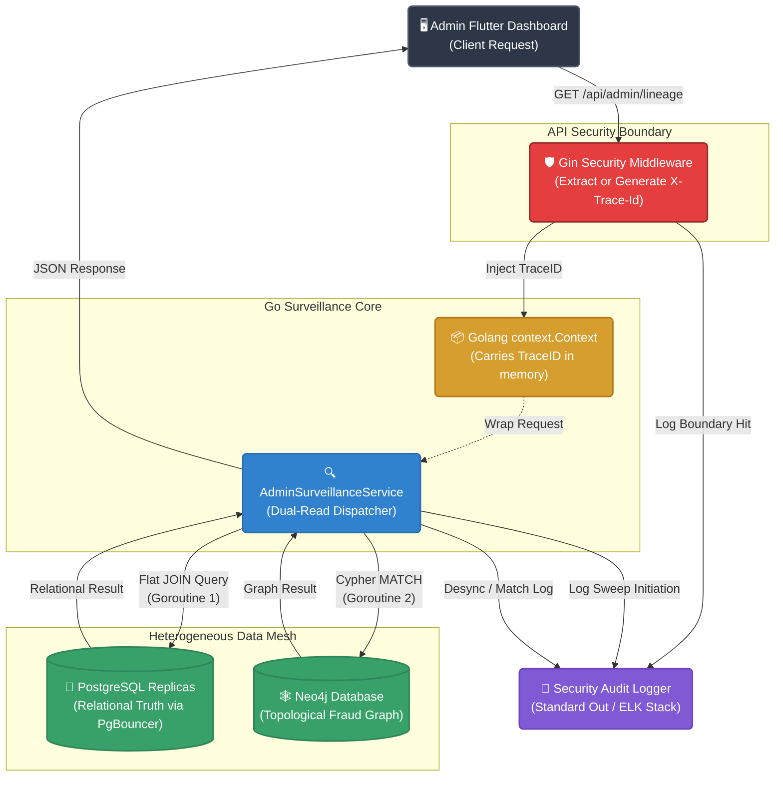
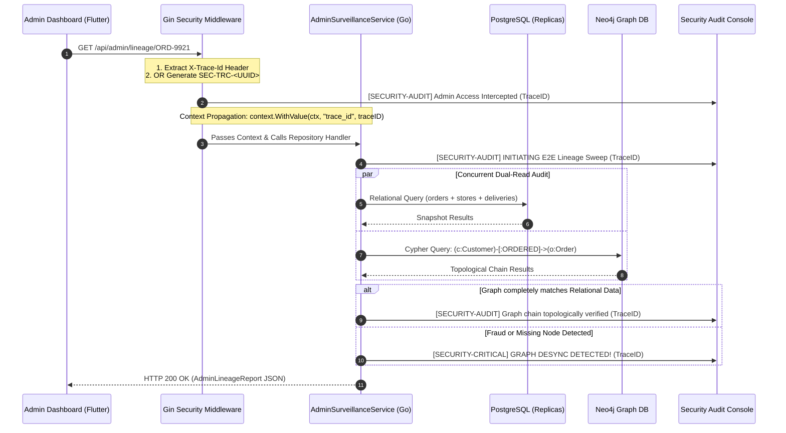

# OMNIGO Security Tracing & Audit Engine

> [!TIP]
> **Obsidian Compatibility:** Paste this code block directly into Obsidian to view the interactive Sequence Diagram of our elite Correlation Trace ID workflow.

## 1. Structural Architecture Diagram (Data Mesh & Tracing)

This block diagram represents the physical and logical architecture of the Admin Security Engine. It shows how the request crosses the security boundary, binds the Trace ID, and fans out concurrently to multiple database systems.

---

## 2. Security Audit Execution Workflow (Sequence Diagram)

This sequence diagram illustrates exactly how the `trace_id` is generated at the network edge, bound to the Golang `context.Context`, and propagated downwards to ensure every single database query and security validation is heavily audited.

---

## 💻 Elite Architectural Concepts Used in Code:

> [!IMPORTANT] 1. Golang Context Propagation (`context.Context`)
> Instead of using global variables which cause severe race conditions in highly concurrent environments, we utilized Go's native `context` package. By using `context.WithValue()`, the Trace ID becomes an invisible metadata backpack that travels strictly with that specific HTTP request lifecycle. Even if 100,000 admins request data simultaneously, their Trace IDs will never collide.

> [!IMPORTANT] 2. Gin Middleware Interception
> We placed a barrier (Middleware) directly in front of the HTTP router (`r.Use()`). No request can touch the database or internal services without first being stripped, inspected, and stamped with a unique `SEC-TRC-` UUID by the logger.

> [!IMPORTANT] 3. Concurrent Dual-Read (Par Block)
> The `AdminSurveillanceService` does not wait for Postgres to finish before querying Neo4j. It represents a highly advanced Scatter-Gather pattern where both heterogeneous databases are queried asynchronously. If the topological chain (Neo4j) is broken but the relational record (Postgres) exists, the system immediately flags a `SECURITY-CRITICAL` fraud vector.
