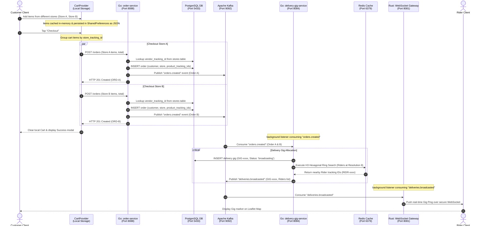

# OMNIGO Phase 5 — Cart, Multi-Vendor Split Checkout & Gig Dispatch Architecture

This document maps out the system architecture and data flows for the E-Commerce Shopping Cart, Multi-Vendor Split Checkout, and real-time Delivery Gig Broadcast pipeline.

---

## 1. High-Level System Architecture

The following diagram illustrates how the frontend cart manager, local persistence, split-order dispatch pipelines, Go microservices, database, message queues, and Rust WebSocket gateway interact.



---

## 2. Core Components Specification

### A. Cart splitting (Flutter Client)
To satisfy the database model where an order is constrained to a single `store_tracking_id`, the client-side cart manager performs grouping logic before dispatching checkout transactions:
```dart
Map<String, List<CartItem>> itemsByStore = {};
for (var item in cartItems) {
  itemsByStore.putIfAbsent(item.storeTrackingId, () => []).add(item);
}
```
This isolates each shop's invoice, tax rate, and delivery pickup coordinates correctly.

### B. Database Schema & Tracking Chain Integrity
During the creation of an order record, the `order-service` executes a lookup query to find the parent owner of the merchant store:
```sql
SELECT vendor_tracking_id FROM stores WHERE store_tracking_id = $1;
```
By mapping the resolved `vendor_tracking_id` alongside the order's metadata, the system builds an immutable lineage chain:
- **`customer_tracking_id`**: Customer buyer identity.
- **`store_tracking_id`**: Specific storefront mapping.
- **`vendor_tracking_id`**: Merchant owner receiving payment payout.
- **`product_tracking_ids`**: Slice of purchased items.

This structure allows the **Admin Surveillance Engine** to track exact product provenance, commissions, and revenue flows.
