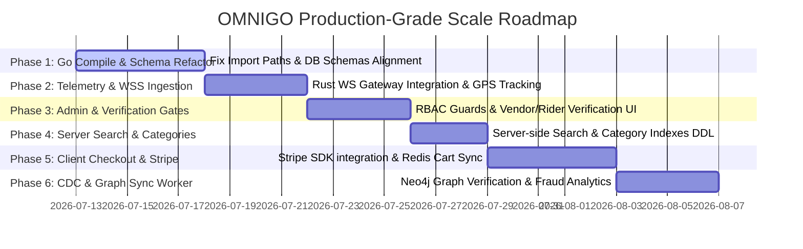

# OMNIGO Super App — Session 15 Master Audit Report

This document compiles the exhaustive audit reports submitted by the four concurrent subagents (General Code Auditor, Customer Feature Auditor, Vendor Feature Auditor, and Admin Panel Auditor) on July 13, 2026.

---

## 🔍 Master System Audit Findings

### 1. General Code & Integration Audit (`general_auditor`)
*   **Compilation & Imports:** `admin-service/main.go` fails to compile because it imports `"omnigo/internal/admin"` instead of `"github.com/omnigo/backend/internal/admin"`.
*   **Empty Config Crash:** If `config.yaml` is absent, services skip default config fallbacks, initializing empty connection strings that crash the pgx pools immediately on startup.
*   **Gin Binding 0-Value Trap:** `ToggleStock` in product service defines `Stock int binding:"required"`. Gin validator rejects `0` values as empty, preventing vendors from marking products as out-of-stock.
*   **Actix WebSocket Auth Mismatch:** The Rust Gateway expects JWT tokens via `?token=...` query parameters, while the Flutter WebSocket client tries to connect using `?tracking_id=...`, triggering immediate 401 Unauthorized rejections.
*   **Docker Bootstrap Bug:** `bootstrap.sh` probes `postgres-primary` while Docker Compose defines the database service as `omnigo-postgres`, blocking CDC pipeline setups.

### 2. Customer-Side Feature Audit (`customer_auditor`)
*   **Shopping Cart & Checkout:** Cart mutations and split multi-vendor routing checkouts are functional on the client. Nonces guard against double-billing. However, the cart is 100% client-side (backend Redis `CartService` is dead code). Stripe and Mobile Wallets are visual mocks; backend `CheckoutService` Stripe intents are dead code.
*   **Search & Categories:** Search is a local text filter on loaded products only. Category pills change headers but do not filter the product list. The backend product service lacks category models/mappings.
*   **Maps & Geocoding:** Leaflet map displays correctly, but city searches are matched against a hardcoded 7-city database. Live store pins and rider location layers are missing.
*   **Order Tracking:** Dynamically loads order history from PostgreSQL, but relies on pull-to-refresh (no WebSocket stream subscription).

### 3. Vendor-Side Feature Audit (`vendor_auditor`)
*   **Dashboard & Processing:** Order retrievals, acceptance workflows, delivery slips, and gig dispatches are fully integrated with Go microservices. However, earnings and active gig metrics are static mocks, and the dashboard has no navigation buttons to access Analytics or Live Map screens.
*   **Inventory CRUD:** Inventory lists are loaded but filtered in Flutter memory, which will crash at scale. Stock toggles use optimistic UI. Product addition, detail editing, and product deletion features are completely missing in the UI.
*   **Live GIS Telemetry:** Telemetry WebSocket streams are mocked via client-side `Timer` routines. The client does not connect to the Rust gateway, and store coordinates are hardcoded to Lahore.

### 4. Admin Panel & Tracking Audit (`admin_auditor`)
*   **Orphaned Service:** The `admin-service` (Go) is not registered or started in the platform launcher scripts. The frontend hub is a mockup of static lists with no API connections.
*   **Zero Authentication:** The `/admin-surveillance` Flutter route has no guards (guests can access it), and the backend lineage API lacks JWT authorization checks.
*   **Broken Queries:** The PostgreSQL query in `admin/service.go` joins tables on incorrect column keys and attempts to select a non-existent database column `current_h3_hexagon` (which is stored in Redis), causing lineage tracing queries to fail.
*   **Verification Lockout:** New riders and vendors register as `is_verified = false`, but no admin API/portal exists to verify/approve them, locking registered users out permanently.
*   **Tracking Gaps:** Admins cannot search users, stores, riders, or gigs; they can only query single order lineages.

---

## 🛠️ Database Schema & Query Mismatches Table

| Microservice Repository | Target Query Field / Column | PostgreSQL Schema Reality (`init.sql`) | Impact |
| :--- | :--- | :--- | :--- |
| `auth_service.go` | `business_name`, `address` | Columns do not exist on `users` table | Registration queries fail. |
| `auth_service.go` | Scans UUID `id` into `int64` | `id` column is defined as `UUID` | Casting scan runtime panic. |
| `product_repository.go` | `product_tracking_id`, `vendor_tracking_id`, `store_tracking_id`, `description`, `base_price`, `stock`, `is_featured`, `image_url` | Columns do not exist on `products` table | Product creations/fetches crash. |
| `order_repository.go` | `order_tracking_id`, `customer_tracking_id`, `store_tracking_id`, `product_tracking_ids` | Columns do not exist on `orders` table | Cart checkouts fail on insert. |
| `delivery_repository.go` | `order_tracking_id`, selects `updated_at` | `order_id` (UUID), `deliveries` table lacks `updated_at` | Telemetry inserts fail. |

---

## 🚀 Calculated Gaps & Remaining Engineering Roadmap

To align OMNIGO to a production-grade scale, **6 engineering phases** must be executed:

