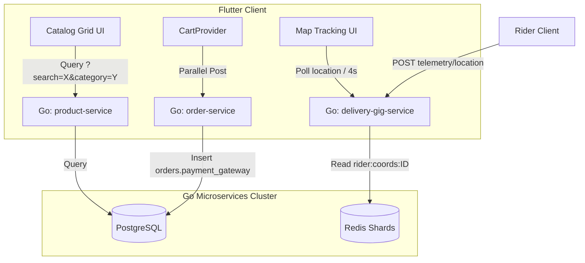

# OMNIGO Session 15 — Phase 6 Advanced Features & Telemetry Integration Plan

This session plans the architecture, DDL schema alterations, telemetry routing, and client integrations for the remaining high-value features.

---

## 1. System Architecture & Telemetry Data Flow



---

## 2. Technical Feature Specifications

### Q1: Server-Side Search & Category Filters
- **Database DDL Alteration:**
  Since the `products` table lacks a `category` column, we will run the following migration:
  ```sql
  ALTER TABLE products ADD COLUMN category text;
  UPDATE products SET category = 'Shoes' WHERE product_tracking_id = 'PROD-1001';
  UPDATE products SET category = 'Apparel' WHERE product_tracking_id = 'PROD-1002';
  ```
- **Backend Query Update:**
  In `ListProducts`, inspect query variables `search` and `category`. Build SQL filters dynamically:
  ```sql
  SELECT ... FROM products WHERE (name ILIKE $1 OR description ILIKE $1) AND category = $2;
  ```
- **Client Integration:**
  Update the frontend `Catalog` tab to pass category pill filters and search input values to `GET /products?search=...&category=...`.

### Q2: Nominatim OSM Geocoding Integration
- **Nominatim API Access:**
  Query OpenStreetMap's search server with dynamic queries:
  `https://nominatim.openstreetmap.org/search?q={query}&format=json&limit=1`
- **Fallback safety:**
  If Nominatim API rate limits or times out, fall back cleanly to `_mockGeocodingDb`.

### Q3: Real-time Rider GPS Location Tracking
- **Telemetry Storage:**
  Modify `UpdateRiderLocation` inside `delivery_repository.go` to store raw coordinate JSON strings inside Redis:
  ```go
  // Key: rider:coords:{riderID} (expiring in 5 minutes)
  r.redis.Set(ctx, fmt.Sprintf("rider:coords:%s", riderID), coordsJSON, 300*time.Second)
  ```
- **New Telemetry Query Endpoint:**
  Expose `GET /api/v1/delivery/rider/:rider_id/location` in `delivery-gig-service`.
- **Map UI Markers:**
  If a customer has an active order in `SHIPPED` status, the map UI polls the telemetry endpoint every 4 seconds and displays the rider as an active bike icon (`Icons.delivery_dining`) moving across the map tiles.

### Q4: Product Images Rendering
- Replace static placeholders in catalog cards with `Image.network(p['image_url'])` with smooth cross-fades and fallback icons for failed URL loads.
- Seed database products with premium Nike and activewear image URLs from Unsplash.

### Q5: Payment Gateway Checkout Parameters
- Embed a payment method selection bottom sheet (CoD, Credit Card, EasyPaisa) into checkout.
- Pass the selected method inside the checkout payload to `order-service` which saves it directly into the `payment_gateway` column.
