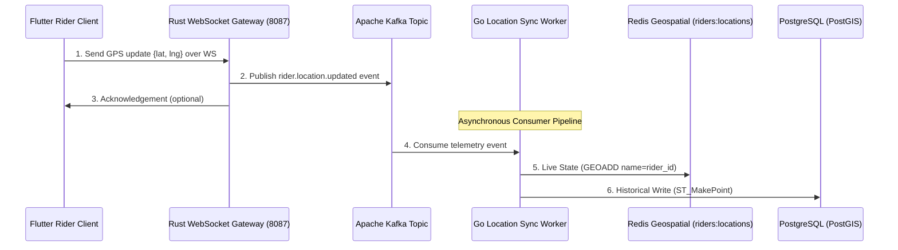

# Session 22 — Execution Plan: Event-Driven Telemetry & Geospatial Sync

> **Created:** July 13, 2026
> **Preceded by:** [[session_21_execution_log]]
> **Architecture:** [[OMNIGO_SuperApp_Architecture]]

---

## 📋 Goal

Design and implement a highly scalable, real-time telemetry and geospatial tracking engine for the Rider app and backend dispatch services:

1. **Decoupled Telemetry Ingestion (Rust)**:
   - Configure the Actix-web WebSocket Gateway to accept rider coordinate updates.
   - Publish coordinates to a partitioned Apache Kafka topic (`rider.location.updated`) in a non-blocking task.
   - Automatically emit an "offline" event to Kafka when a rider's connection terminates.
2. **Decoupled Location Sync Worker (Go)**:
   - Create a Go consumer (`location-sync-worker`) that reads the location updates.
   - Perform a **Dual-Write**:
     - **Live State**: Update the Redis Geospatial index `riders:locations` (`GEOADD` / `ZREM`).
     - **Historical State**: Batch insert coordinates into PostgreSQL `rider_location_history` using PostGIS `ST_SetSRID` and `ST_MakePoint`.
3. **Geospatial Order Assignment (Go)**:
   - Refactor `delivery-gig-service` to query the live Redis `riders:locations` index using `GEORADIUS` to match ready orders to the nearest riders within a 5km radius.
4. **Flutter Background Telemetry Service (Flutter)**:
   - Integrate `flutter_background_service` and `web_socket_channel` to stream live hardware GPS coordinates to NGINX/WebSocket gateway even when the app is minimized.
   - Bind the background service directly to a "Go Online / Go Offline" toggle in the Rider Map UI.

---

## 📐 Architecture Design (Hybrid Telemetry Engine)

---

## ⚡ Execution Steps

| Step | Component | Action |
|------|-----------|--------|
| 1 | Rust WebSocket Gateway | Implement `FutureProducer` Kafka publisher inside WS actor. |
| 2 | Rust WebSocket Gateway | Capture Actor connection termination and emit "offline" packet. |
| 3 | Go Location Sync Worker | Create `location-sync-worker` daemon to consume Kafka & perform Redis + PostGIS write. |
| 4 | Go Delivery Service | Refactor `delivery_service.go` to match riders via Redis `GEORADIUS`. |
| 5 | Flutter Rider App | Implement `telemetry_service.dart` with Android foreground background services. |
| 6 | Flutter Rider UI | Replace local mock timers with real background service toggling. |
| 7 | Verification | Run compiling tests, run E2E telemetry stream. |
