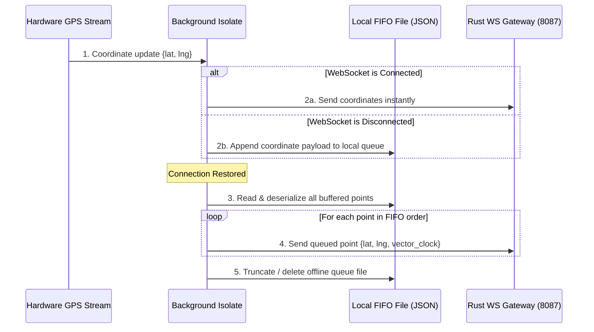
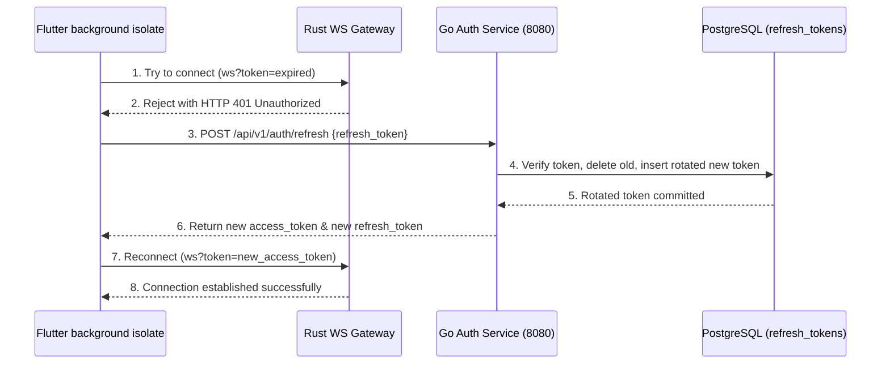

# Session 24 — Execution Plan: Local Telemetry Buffering & JWT Refresh Rotation

> **Created:** July 13, 2026
> **Preceded by:** [[session_23_execution_log]]
> **Architecture:** [[OMNIGO_SuperApp_Architecture]]

---

## 📋 Goal

Harden mobile client reliability and backend authentication lifecycles for multi-day rider shifts:

1. **Rider Telemetry Offline Buffering (Flutter)**:
   - Implement a robust file-based FIFO queue (`telemetry_offline_queue.json`) in the device's local application document directory to store telemetry coordinates when internet connectivity is lost.
   - When the background isolate detects that the WebSocket connection is down, it appends coordinates to the local queue.
   - Upon reconnection, it flushes the queue sequentially (FIFO) to the WebSocket gateway before transmitting real-time coordinates.
2. **JWT Refresh Token Rotation (Go Backend & Flutter)**:
   - **Backend**: Create a PostgreSQL table `user_refresh_tokens` and add a new REST endpoint `POST /api/v1/auth/refresh` to `auth-service` to support Refresh Token Rotation (RTR).
   - **Frontend**: Store both the short-lived `access_token` (expires in 1 hour) and the long-lived `refresh_token` in `SharedPreferences`.
   - **Isolate**: If the WebSocket connection fails with a 401 Unauthorized error or the token is expired, the background isolate executes an HTTP POST to `/refresh` to obtain new tokens, saves them, and reconnects.
3. **End-to-End Telemetry Test Harness (Go / Python)**:
   - Create an automated end-to-end integration test script that establishes virtual rider WebSockets, publishes telemetry, and verifies PostGIS/Redis state updates.

---

## 📐 Architecture Design (Offline Buffering & Refresh Rotation)

### 1. Offline Telemetry Buffering Flow

### 2. Refresh Token Rotation (RTR) Flow

---

## ⚡ Execution Steps

| Step | Component | Action |
|------|-----------|--------|
| 1 | Postgres Schema | Add `user_refresh_tokens` table to `init.sql` (schema: ID, user_tracking_id, token_hash, expires_at, revoked). |
| 2 | Go Auth Service | Implement Refresh Token generation inside `Login` and add `POST /auth/refresh` handler implementing Refresh Token Rotation (RTR). |
| 3 | Flutter Client | Update `SessionRegistry` to store/retrieve both access and refresh tokens. |
| 4 | Flutter Telemetry Isolate | Write file-based FIFO persistence queue logic (`telemetry_offline_queue.json`) using `path_provider` and `dart:io`. |
| 5 | Flutter Telemetry Isolate | Implement token expiration checks and HTTP refresh triggers inside the background isolate reconnection loop. |
| 6 | E2E Testing | Create `scripts/test_e2e_telemetry.py` to assert the entire pipeline works automatically. |
| 7 | Verification | Run compile checks (`cargo check`, `go build`, `flutter analyze`). |
