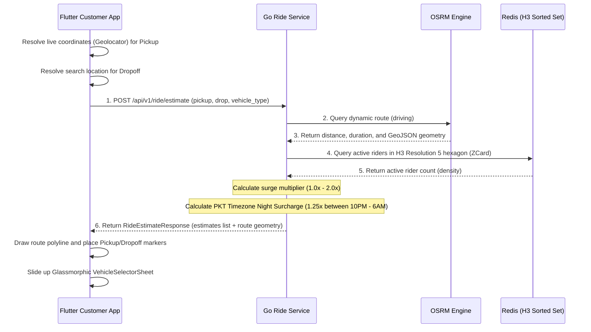

# Session 26 — Execution Plan: Dynamic Surge & Multi-Vehicle Pricing Engine (Improved)

> **Created:** July 14, 2026
> **Preceded by:** [[session_25_execution_plan]]
> **Architecture:** [[OMNIGO_SuperApp_Architecture_V2]]

---

## 📋 Goal

Implement dynamic base rate pricing models, vehicle selectors, and automated surge multipliers under high demand, with unified route polyline extraction and dynamic user coordinate selectors.

---

## 📐 Architecture Design

---

## 📐 Mathematical Formulas

The total estimated fare for a vehicle is calculated as:

$$\text{Fare} = \left(\text{BaseFare} + (\text{PerKmRate} \times \text{DistanceKm}) + (\text{PerMinRate} \times \text{DurationMinutes})\right) \times \text{SurgeMultiplier} \times \text{NightMultiplier}$$

### 🚗 Vehicle Rate Matrix (PKR)
| Vehicle Type | Base Fare | Per Km Rate | Per Min Rate |
|--------------|-----------|-------------|--------------|
| **Bike**     | 50.00     | 15.00       | 2.00         |
| **Rickshaw** | 80.00     | 20.00       | 3.00         |
| **Car**      | 150.00    | 35.00       | 5.00         |

### 🌌 Night Surcharge Multiplier
- **Multiplier**: `1.25x`
- **Applicability**: Between **10:00 PM (22:00)** and **6:00 AM (06:00)** Pakistan Standard Time (PKT / UTC+5).
- **Timezone Resolution**: Server-side logic resolves timezone dynamically to `"Asia/Karachi"` or falls back to manual `UTC+5` offsets.

### ⚡ Surge Multiplier (H3 Density)
Rider density is queried from Redis Sorted Set at Resolution 5: `riders:locations:h3:<h5_hex>` using `ZCard`.
- **density >= 10**: `1.0x`
- **density >= 5**: `1.2x`
- **density >= 1**: `1.5x`
- **density == 0**: `2.0x` (fallback to max surge when no riders are online in the area)

---

## ⚡ Execution Steps

### 1. Backend: Go Pricing & Route API Refactoring
- **Files:**
  - `backend/go-services/internal/delivery/models/delivery.go`
  - `backend/go-services/internal/delivery/service/delivery_service.go`
- **Actions:**
  - Define `RideEstimateResponse` struct to hold both fare estimates and the route polyline coordinate list (`[][]float64`).
  - Refactor `EstimateRide` method to fetch route distance, duration, and GeoJSON geometry coordinates from OSRM.
  - Apply the exact vehicle pricing matrix, timezone-aware PKT night surcharge, and Redis H3-density surge multiplier.
  - Return the unified response back to the client.

### 2. Frontend: Map Polyline & Vehicle Selector
- **Files:**
  - `frontend/omnigo_app/lib/features/customer/presentation/widgets/vehicle_selector_sheet.dart`
  - `frontend/omnigo_app/lib/features/customer/presentation/screens/customer_dashboard_screen.dart`
- **Actions:**
  - Create the `VehicleSelectorSheet` with dynamic glassmorphism (backdrop filter blur,Outfit typography, state-aware card selection, dynamic prices, and ETAs).
  - Implement a fallback mechanism to approximate distance/duration via Haversine logic in case the OSRM endpoint fails.
  - Update the Map tab in the dashboard: get the user's active location for Pickup, and when a location search completes, draw the route polyline on the map, place Pickup and Dropoff markers, and show the vehicle sheet.
