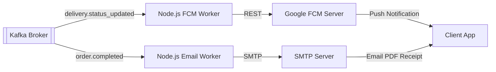

# Session 27 — Execution Plan: Node.js/FCM Push Notification Worker & Receipts

> **Created:** July 13, 2026
> **Preceded by:** [[session_26_execution_plan]]
> **Architecture:** [[OMNIGO_SuperApp_Architecture_V2]]

---

## 📋 Goal

Integrate real-time device push notifications and automated email receipt generation using Kafka event-driven consumers.

---

## 📐 Architecture Design

---

## ⚡ Execution Steps

### 1. Node.js: FCM Notification Worker
- **File:** `backend/node-services/notification-service/worker.js`
- **Actions:**
  - Build consumer subscribing to `delivery.status_updated` and `orders.created`.
  - Format FCM notifications using `firebase-admin` payload patterns.
  - Implement dynamic fallback printing logs if credentials are mock/sandbox.

### 2. Node.js: Email Receipts Worker
- **File:** `backend/node-services/email-service/worker.js`
- **Actions:**
  - Subscribe to order completed topic.
  - Generate HTML billing invoice template.
  - Render PDF binary payload and email using `nodemailer` package.
