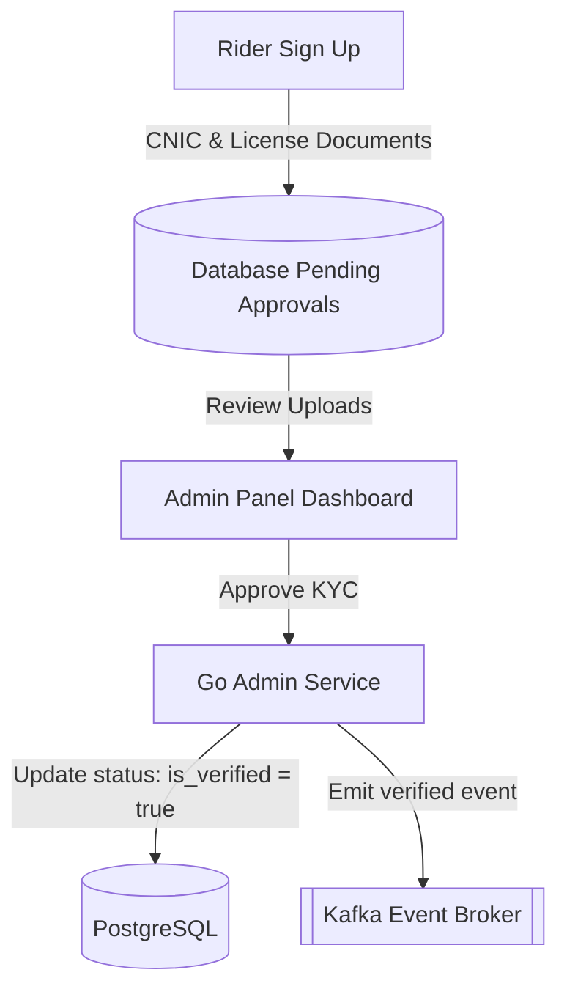

# Session 28 — Execution Plan: Security Hardening & Admin KYC/KYB Testing

> **Created:** July 13, 2026
> **Preceded by:** [[session_27_execution_plan]]
> **Architecture:** [[OMNIGO_SuperApp_Architecture_V2]]

---

## 📋 Goal

Harden admin user controls, document validations, and execute automated validation sweeps.

---

## 📐 Architecture Design

---

## ⚡ Execution Steps

### 1. Backend: Go Admin KYC Engine
- **File:** `backend/go-services/internal/admin/service/admin_service.go`
- **Actions:**
  - Build route handler to list pending registrations (`/api/v1/admin/verifications`).
  - Refine document link checking validation. Add basic fraud indicators (crosscheck CNIC syntax format).
  - Wired token updates. Approving sets `is_verified` flags and dispatches events.

### 2. Testing: Automated Verification Harness
- **File:** `scripts/test_e2e_verification.go`
- **Actions:**
  - Write test client executing signup, asserting verification flags blocker block, logging admin KYC trigger, verifying activation response.
  - Compile and execute validation.
