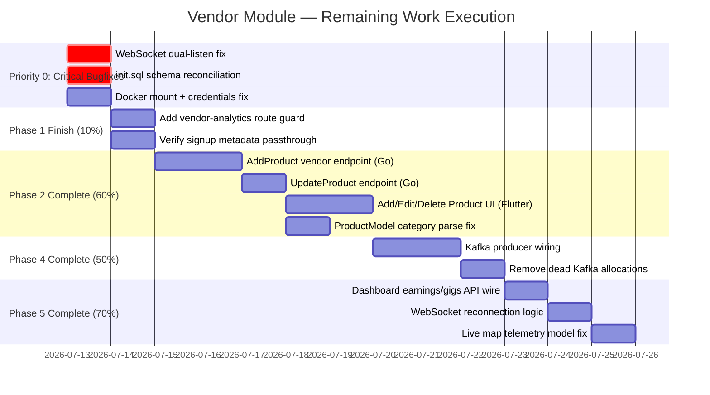

# Vendor Remaining Phases — Execution Roadmap

> **Created:** July 13, 2026 (Session 16)
> **Source Audit:** [[vendor_module_complete_audit]]
> **Architecture:** [[OMNIGO_SuperApp_Architecture]]
> **Original Plan:** [[session_10 vendor audit#4. The 5-Phase Vendor Module Plan]]

---

## ═══════════════════════════════════════
## PRIORITY EXECUTION ORDER
## ═══════════════════════════════════════

---

## ═══════════════════════════════════════
## PRIORITY 0: Critical Bugfixes
## ═══════════════════════════════════════

> These MUST be fixed before any feature work. They cause runtime crashes.

### P0-A: WebSocket Dual-Listen Crash Fix
- **File:** `frontend/omnigo_app/lib/core/network/websocket_client.dart`
- **Bug:** `connect()` consumes the single-subscription stream via `.listen()`. The `get stream` getter returns the same stream — causing `Bad state: Stream has already been listened to.`
- **Fix Strategy:**
  1. Remove the internal `.listen()` inside `connect()`
  2. Use a `StreamController.broadcast()` to re-broadcast the single-subscription channel stream
  3. Expose the broadcast stream via the `stream` getter
  4. Add platform-aware host resolution (use `ApiEndpoints` base URL instead of hardcoded `localhost:8087`)
- **Backlink:** Bug #1 in [[vendor_module_complete_audit#E. CRITICAL BUGS REGISTRY]]

### P0-B: init.sql Schema Reconciliation
- **File:** `infrastructure/postgres/init.sql`
- **Problem:** init.sql uses UUID FKs, different table names, and different column names vs what Go code actually queries.
- **Fix Strategy:** **Rewrite init.sql to match the live DB schema that Go code expects.** The Go code is the source of truth since it's what actually runs.
  - `stores` table (not `vendor_stores`) with `vendor_tracking_id, store_tracking_id, store_name, latitude, longitude`
  - `products` with `product_tracking_id, vendor_tracking_id, store_tracking_id, name, description, base_price, stock, is_featured, image_url, category`
  - `orders` with `order_tracking_id, customer_tracking_id, store_tracking_id, vendor_tracking_id, product_tracking_ids, status, total_amount, currency`
  - `deliveries` with `tracking_id, order_tracking_id, rider_tracking_id, status, admin_commission`
  - `users` with `tracking_id, email, password_hash, first_name, last_name, phone, role, region, is_verified, business_name, address`
- **Backlink:** Section C in [[vendor_module_complete_audit#C. INFRASTRUCTURE DIVERGENCE]]

### P0-C: Docker Config Fixes
- **File:** `infrastructure/docker/docker-compose.yml`
- **Fixes:**
  1. Mount `infrastructure/postgres/init.sql` into `/docker-entrypoint-initdb.d/`
  2. Align credentials: `omnigo_user / omnigo_password / omnigo_db`
  3. Delete stale `mock_data.sql` from root directory

---

## ═══════════════════════════════════════
## PHASE 1 FINISH: Auth & Navigation (10% remaining)
## ═══════════════════════════════════════

### P1-A: Vendor Analytics Route Guard
- **File:** `frontend/omnigo_app/lib/main.dart`
- **Fix:** Add `/vendor-analytics` to the role-guarded route block alongside dashboard, inventory, live-map
- **Backlink:** Bug #7 in [[vendor_module_complete_audit#E. CRITICAL BUGS REGISTRY]]

### P1-B: Verify Signup Metadata Passthrough
- **File:** `frontend/omnigo_app/lib/features/auth/presentation/screens/dynamic_signup_screen.dart`
- **Check:** Verify that business_name and address fields are sent to the auth-service API on vendor registration
- **Backlink:** [[session_10 vendor audit#Phase 1]]

---

## ═══════════════════════════════════════
## PHASE 2 COMPLETE: Dynamic Catalog CRUD (60% remaining)
## ═══════════════════════════════════════

### P2-A: Vendor-Specific AddProduct Endpoint
- **New Code in:** `backend/go-services/internal/product/handlers/vendor_product_handler.go`
- **Route:** POST `/api/v1/vendor/products/`
- **Requirements:**
  - Extract vendor tracking ID from Authorization header (same pattern as ToggleStock/Delete)
  - Accept: name, description, sku, base_price, stock, category, image_url, store_tracking_id
  - Validate vendor owns the store_tracking_id before inserting
  - Call existing `repository.CreateProduct()` with auto-generated PROD-xxxxxx tracking ID
- **Backlink:** [[vendor_module_complete_audit#Phase 2: Dynamic Catalog CRUD]]

### P2-B: UpdateProduct Endpoint
- **New Code in:** `vendor_product_handler.go` + `product_repository.go`
- **Route:** PUT `/api/v1/vendor/products/:product_id`
- **Requirements:**
  - Ownership verification (vendor_tracking_id match)
  - Partial update support: only update fields that are provided
  - Redis cache invalidation after update (use existing pipeline pattern)

### P2-C: Flutter Add/Edit/Delete Product UI
- **Files:**
  - New: `vendor_add_product_screen.dart` — Form with name, description, price, stock, category dropdown, image URL
  - Modify: `vendor_inventory_screen.dart` — Add "+" FAB button, swipe-to-delete, tap-to-edit navigation
- **Requirements:**
  - Add Product: POST to vendor AddProduct endpoint → navigate back on success
  - Edit Product: Pre-fill form → PUT to UpdateProduct endpoint
  - Delete Product: Confirmation dialog → DELETE to existing endpoint → remove from list

### P2-D: Flutter ProductModel Category Parse
- **File:** `vendor_inventory_screen.dart` (or shared model)
- **Fix:** Add `category` field to `ProductModel.fromJson()` parsing

---

## ═══════════════════════════════════════
## PHASE 4 COMPLETE: Kafka & Cache (50% remaining)
## ═══════════════════════════════════════

### P4-A: Kafka Producer Wiring
- **Strategy Decision Required:**
  - Option A: Wire existing Kafka client in product-service to emit `product.updated` events on stock changes, price updates, new product additions
  - Option B: Defer Kafka integration until the event consumers (notification service, CDC pipeline) are ready to process events
- **Recommendation:** Option B — Kafka events without consumers are wasted work. Clean up dead allocations first.

### P4-B: Remove Dead Kafka Allocations
- **Files:** `vendor-store-service/main.go`, `product-service/main.go`
- **Fix:** Remove unused Kafka client initialization (lines that allocate but never pass the client)

---

## ═══════════════════════════════════════
## PHASE 5 COMPLETE: Live Map & Dashboard (70% remaining)
## ═══════════════════════════════════════

### P5-A: Dashboard Earnings & Gigs API Wire
- **File:** `vendor_dashboard_screen.dart`
- **Fix:**
  - Replace hardcoded `$300.00` earnings with real API call to `GET /api/v1/vendor/metrics` (already exists!)
  - Replace hardcoded `2 Gigs` with count of orders with status = 'shipped'
  - Use existing `VendorMetricsResponse` data

### P5-B: WebSocket Reconnection Logic
- **File:** `websocket_client.dart`
- **Add:** Exponential backoff reconnection (1s → 2s → 4s → max 30s)
- **Add:** Connection state enum (connecting, connected, disconnected, reconnecting)

### P5-C: Live Map Telemetry Model Fix
- **File:** `vendor_live_map_screen.dart`
- **Current Bug:** Telemetry model parses "inventory price updates" instead of rider GPS coordinates
- **Fix:** Align telemetry frame parsing with actual Rust WebSocket gateway output format (lat/lng/rider_id/timestamp)
- **Dependency:** Requires Rust WS gateway to be running (Phase 2 of master roadmap from [[session_15_audit_report]])

---

## ═══════════════════════════════════════
## RECOMMENDED EXECUTION SEQUENCE
## ═══════════════════════════════════════

| Step | Task | Est. Time | Dependencies |
|------|------|-----------|--------------|
| 1 | P0-B: Rewrite init.sql to match Go code | 30 min | None |
| 2 | P0-C: Fix docker-compose mount + credentials | 15 min | Step 1 |
| 3 | P0-A: Fix WebSocket dual-listen bug | 20 min | None |
| 4 | P1-A: Add vendor-analytics route guard | 5 min | None |
| 5 | P1-B: Verify signup metadata passthrough | 10 min | None |
| 6 | P2-D: Fix ProductModel category parse | 5 min | None |
| 7 | P2-A: Build AddProduct vendor endpoint | 30 min | None |
| 8 | P2-B: Build UpdateProduct endpoint | 25 min | Step 7 |
| 9 | P2-C: Build Add/Edit/Delete Flutter UI | 45 min | Steps 7+8 |
| 10 | P5-A: Wire dashboard earnings/gigs to real API | 15 min | None |
| 11 | P4-B: Clean dead Kafka allocations | 10 min | None |
| 12 | P5-B: Add WebSocket reconnection logic | 20 min | Step 3 |

**Total Estimated Time: ~3.5 hours**

---

> **Decision Point:** Kafka producer (P4-A) and Live Map telemetry model (P5-C) are deferred because they depend on infrastructure (Kafka consumers, Rust WS gateway) that isn't ready yet. These belong to the master roadmap Phases 2-3 from [[session_15_audit_report]].
