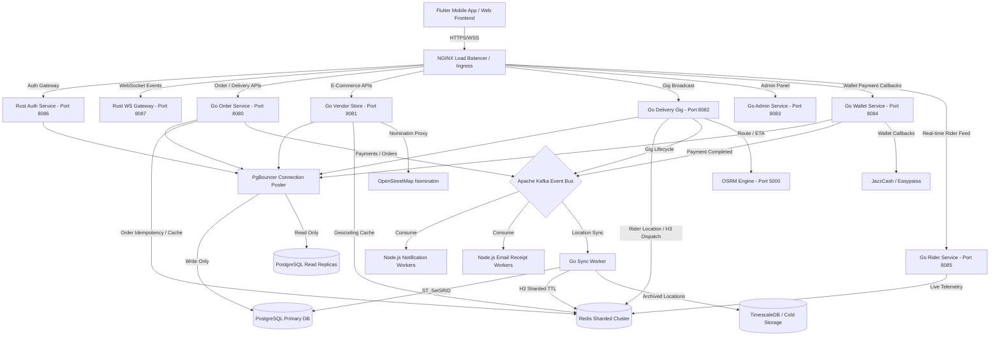
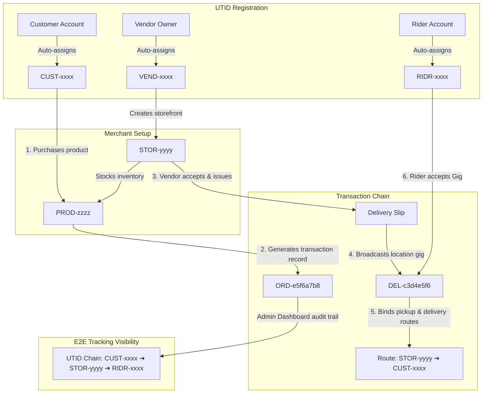
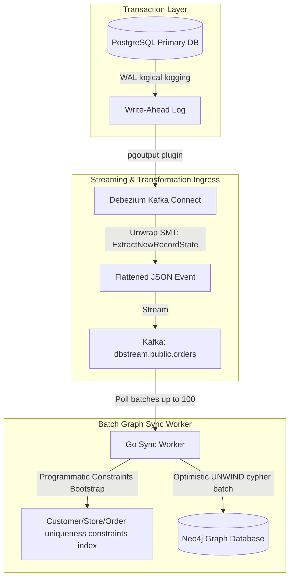
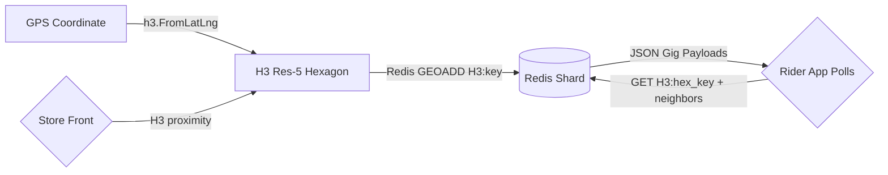

# OMNIGO Super App Architecture & System Manual
## (Billion Dollar Enterprise Design Plan - 9M Concurrent Scale)

This document contains the complete system architecture, data models, tracking logics, and polyglot integration pathways of the **OMNIGO Super App** ecosystem, optimized to support 9 Million active concurrent users.

---

## 1. High-Level Scalable Architecture Diagram

To handle high concurrency, eliminate Single Points of Failure (SPOF), and optimize I/O and compute workloads:



---

## 2. Universal Tracking ID (UTID) Schema

To maintain complete tracking visibility across the multi-vendor, multi-service chain, the system automatically assigns prefixed tracking IDs to all entities upon registration.

**Format (verified against code — `internal/shared/tracking/tracking.go`):**
```
<PREFIX>-<8 hex chars>        e.g. CUST-a1b2c3d4
```
The suffix is 8 hexadecimal characters generated from 4 random bytes via `crypto/rand`. If OS entropy ever fails (GW-23), a splitmix-style timestamp churn is used as an emergency fallback so IDs stay unguessable and unique under concurrency.

| UTID Prefix | Entity | Target Database | Description |
| :--- | :--- | :--- | :--- |
| `CUST-` | Customer | `users` (Role: customer) | Tracks buyer identity, payment settings, order history. |
| `RIDR-` | Rider | `users` (Role: rider) | Tracks location, driver license status, deliveries, and ride status. |
| `VEND-` | Vendor Owner | `users` (Role: vendor) | Tracks merchant profile and payouts. |
| `ADMN-` | Admin | `users` (Role: admin) | Platform administrator identity (`GenerateForRole`). |
| `STOR-` | Vendor Storefront | `vendor_stores` | Links products and custom inventory to the owner. |
| `PROD-` | Product item | `products` | Links each product back to its parent `STOR-` store. |
| `ORD-` | Customer Order | `orders` | The purchase transaction linking `CUST-` ➔ `PROD-` ➔ `STOR-`. |
| `DEL-` | Broadcasted Delivery Gig | `deliveries` | Active shipment delivery gig on maps. Linked to its parent order via `OrderTrackingID`. |
| `RIDE-` | Uber-style hail request | `rides` | Active ride-hailing tracking ID. |

> **Note:** Earlier drafts of this document used `GIG-` as the delivery prefix. The actual production code (`internal/delivery/service/delivery_service.go`) generates `DEL-` tracking IDs.

### UTID Lifecycle & Relationship Flowchart

How IDs are linked dynamically through the app ecosystem:



### Order Chain Database Schema (Verified Against Migrations)

Source of truth: `backend/go-services/migrations/000001_omnigo_baseline.up.sql` + incremental migrations.

**Chain hub tables & linking columns:**

```
users (CUST- / VEND- / RIDR- / ADMN- all live here)
│  tracking_id VARCHAR(50) UNIQUE  +  idx_users_tracking_id
│
├─► stores        store_tracking_id UNIQUE, vendor_tracking_id, idx(vendor, tracking_id)
├─► products      product_tracking_id UNIQUE, vendor_tracking_id + store_tracking_id
└─► orders ★ CHAIN HUB ★
      order_tracking_id    VARCHAR(50) UNIQUE NOT NULL
      customer_tracking_id VARCHAR(50) NOT NULL
      store_tracking_id / vendor_tracking_id NOT NULL / rider_tracking_id (set on accept)
      escrow_released, dispute_status, delivered_at   ← 48h escrow gate
      indexes: customer, vendor, rider, store, status, payment_status, nonce
```

**Downstream chain tables (all keyed by `order_tracking_id`):**

| Table | Own ID | Parent Links | Notable Constraint |
| :--- | :--- | :--- | :--- |
| `order_items` | — | order + product | `CHECK (quantity > 0)` |
| `deliveries` | `tracking_id UNIQUE` (`DEL-`) | order + store + customer + rider | DB-enforced FSM: `CHECK (status IN ('broadcasting','accepted','picked_up','in_transit','completed','failed'))` |
| `payment_transactions` | `transaction_id UNIQUE` | order | Partial unique index: only ONE active payment attempt per order |
| `escrow_holds` | — | order + vendor | `hold_until` gates release |
| `cod_debts` | — | rider + order | COD cash reconciliation |
| `disputes` | `tracking_id UNIQUE` | order + filer | blocks escrow auto-release |
| `ledger_entries` | `transaction_id UUID` | generic `reference_type + reference_id` | HMAC-SHA256 `signature` per entry |

**Key integrity guarantees (database-enforced):**

1. **Order idempotency** — duplicate orders are impossible even if Redis is down:
```sql
CONSTRAINT orders_idempotency_unique
UNIQUE (customer_tracking_id, device_session_nonce);
```

2. **Single active payment attempt per order** (double-charge protection):
```sql
CREATE UNIQUE INDEX ux_payment_active_order
ON payment_transactions(order_tracking_id)
WHERE status IN ('processing','3ds_required','settlement_pending','gateway_pending');
```

3. **Hot-path indexes** (migration `000042`, Session 61 audit): `deliveries(customer_tracking_id)`, `orders(store_tracking_id)`, `cod_debts(order_tracking_id)`.

> **⚠️ Design Note — No SQL Foreign Keys:** The chain is linked by indexed `*_tracking_id` columns, but there are **zero `FOREIGN KEY ... REFERENCES` constraints** in the entire migration set. Referential validation happens at the application layer (e.g. `order_repository.go` runs explicit `EXISTS` checks for STOR-/VEND-/PROD- inside the insert transaction). This is an intentional trade-off common in event-driven architectures:
>
> - ✅ Benefit: clean Debezium CDC streaming (no FK ordering/cascade issues), saga-friendly async writes across services.
> - ⚠️ Risk: the database itself will not reject orphaned rows if application code has a bug; integrity depends on code discipline.
>
> If stricter guarantees are ever needed, deferred FK constraints on critical links (e.g. `orders.customer_tracking_id`) can be added incrementally.

---


## 3. High-Concurrency Scaling & Bottleneck Fixes (9 Million Concurrent Users)

To achieve true high-concurrency scale, the core system layout utilizes the following optimization patterns:

### A. Database Layer: PgBouncer + PostgreSQL Read Replicas
- **The Bottleneck:** Heavy transactional writes mixed with millions of concurrent read queries (such as checking catalogs and profile lookups) will lock the Postgres primary database.
- **The Solution:**
  - **PgBouncer Connection Pooler:** Sits between the microservices (Go/Rust) and PostgreSQL to prevent connection exhaustion.
  - **Read/Write Segregation:** All writes (orders placement, signups) are directed to the **PostgreSQL Primary DB**. All reads (catalog browsing, tracking status) are load-balanced across 3+ **PostgreSQL Read Replicas**.

### B. Geo-Spatial Layer: Redis Sharded Cluster with TTL & Cold Archiving
- **The Bottleneck:** Storing millions of live location tracks in Redis memory will cause Out-Of-Memory (OOM) errors.
- **The Solution:**
  - **Short TTLs:** Location logs in Redis expire automatically after a short TTL (e.g. 5 minutes).
  - **Cold Storage (TimescaleDB):** A background archiving worker batches location logs from Redis and writes them to **TimescaleDB** (time-series database) for long-term audit trail and analytics, keeping Redis lightweight.

### C. Map Routing Layer: OSRM Stateless Auto-scaling Cluster
- **The Bottleneck:** Distance/ETA computations are highly CPU-intensive and will crash a single OSRM instance.
- **The Solution:**
  - **OSRM Auto-scaling Cluster:** OSRM instances run inside a stateless Kubernetes cluster that dynamically scales up/down based on CPU load.

### D. AI Intelligence Layer: Asynchronous Kafka Pipeline
- **The Bottleneck:** Python's synchronous performance will choke the Go core API if connected via synchronous REST requests.
- **The Solution:**
  - **Asynchronous Batching:** Go pushes recommendation/fraud analysis jobs to Kafka. The Python AI engine consumes them in batches, runs models, and pushes results back to Kafka asynchronously. gRPC is utilized for high-speed synchronous ML calls when immediate response is mandatory.

---

## 4. CDC & Neo4j Batch Graph Synchronization Pipeline

To ensure real-time lineage mapping and fraud audit logs without database double-write errors, the system relies on a Change Data Capture (CDC) pipeline synced to the Neo4j Graph Database.

### System Diagram



### Architecture Specifications

1. **Unwrap SMT Flattening:**
   Debezium is configured to unwrap complex metadata envelopes (before, after, source properties) directly at the Kafka Connect layer. The resultant Kafka message is a lightweight, flat JSON object containing raw changed table rows.
2. **UNWIND Batch Processing:**
   The Go Sync Worker polls Kafka records and aggregates them into memory buffers. When the buffer reaches 100 items or 500ms has elapsed, it flushes the batch to Neo4j in a single transaction using the Cypher `UNWIND` command, eliminating multi-node locking contention and database deadlocks.
3. **Automated Schema Constraints:**
   On startup, the Go Sync worker programmatically verifies that uniqueness constraints on `utid` properties exist for `Customer`, `Store`, and `Order` nodes, optimizing index lookup times to sub-millisecond ranges.

---

## 5. Order Idempotency (Fail-Closed)

All order writes use PostgreSQL unique constraints rather than Redis SETNX for correctness enforcement:

| Guard | Mechanism | Failure Mode |
| :--- | :--- | :--- |
| Duplicate Order | `idempotency_key` unique constraint (23505) | Returns existing order, never double-charges |
| Product Reserve | `vendor_tracking_id` + `store_tracking_id` unique constraint | Returns existing reservation IDs |
| Inventory Oversell | `FOR UPDATE` row lock on product stock in the same transaction | Rolls back cleanly on CheckViolation |

Kafka events (`payments.order.created`) use exactly-once delivery semantics via Postgres-backed idempotency keys, not Redis ephemeral state.

---

## 6. Wallet Payment Security (HMAC-SHA256)

Wallet callbacks (JazzCash / Easypaisa) are verified using a three-salt HMAC signing scheme:

```
HMAC-SHA256(
  order_id + amount + transaction_id + timestamp,
  JAZZCASH_SALT | EASYPAISA_SALT
)
```

| Component | Storage |
| :--- | :--- |
| `JAZZCASH_SALT` | Environment variable, per-deployment |
| `EASYPAISA_SALT` | Environment variable, per-deployment |
| `WALLET_INTEGRITY_SALT` | Environment variable, shared fallback |

On valid callback: order marked `paid`, `payments.wallet.completed` published to Kafka, rider wallet credited atomically.

---

## 7. H3 Geospatial Dispatch (Hexagonal Grid)

Gig dispatch uses H3 resolution 5 (≈2 km² hexagons) for rider-store alignment:



- Redis stores gig IDs in H3-indexed keys with 15-minute TTL (gig expiry).
- `FOR UPDATE` row lock in Postgres reserves accepted gig (deadlock-free via H3 partition key order).
- Background sync worker writes archived gigs to TimescaleDB for analytics.

---

## 8. Vendor Product Pagination (Cursor-Based)

`GET /api/v1/vendor/:id/products` uses limit/offset pagination (max 100 per page):

| Parameter | Default | Max |
| :--- | :--- | :--- |
| `limit` | 20 | 100 |
| `offset` | 0 | unbounded |

Flutter implements infinite scroll via `NotificationListener<ScrollNotification>`, `RefreshIndicator`, and `_hasMore`/`_offset` state. `flutter analyze` passes clean.

---

## 9. Geocoding Proxy (Nominatim + Redis Cache)

`GET /api/v1/geocoding/search?q=...` proxies to OpenStreetMap Nominatim with two protection layers:

| Layer | Mechanism | Scope |
| :--- | :--- | :--- |
| Redis Cache | MD5 query hash key, 24h TTL | All requests |
| Token Bucket | 10 tokens / 60s refill | Per client IP |

Cache key format: `geocoding:search:<md5(querystring)>`. Responses are cached at the JSON blob level. If Redis is unavailable, the handler falls back to Nominatim directly (rate limiter still active).

---

## 10. Dynamic Live Map Routing & GIS Engine

The real-time OSRM routing layer maps exact road paths between riders and merchant storefronts dynamically:

```
[Rider Location App] --> WebSocket Gateway (Port 8087) --> Redis Spatial / Kafka
                                                               |
[Vendor Live View] <--- WSS Telemetry (order_tracking_id) <----+
        |
        +--> HTTP GET /api/v1/delivery/gig/:gig_id/route --> OSRM Route Engine (GeoJSON Polyline)
```

1. **Rider Telemetry**: Rider coordinates are broadcasted via WS client streams containing coordinates, velocity, and the active `order_tracking_id`.
2. **Dynamic Route Request**: Upon receiving a telemetry packet, the Vendor UI queries the `delivery-gig-service` via `/api/v1/delivery/gig/:gig_id/route` to retrieve the road route path geometries from OSRM.
3. **Map Rendering**: Rendered as a `PolylineLayer` matching actual road pathways on OSM tiles, eliminating straight-line approximations.

---

## 11. Bidding / Fare Negotiation & Segmented Service Architecture

The ride-hailing core enables custom price negotiation (inDriver-style) alongside segmented passenger and courier service handling:

```
                       [Customer App]
                             |
         +-------------------+-------------------+
         |                                       |
  [Passenger Ride]                       [Courier / Parcel]
         |                                       |
   Bikes / Cars                            Delivery Gigs
         |                                       |
         +-------------------+-------------------+
                             |
                   [Estimate & Bargain]
                             |
                Toggle: Custom Fare Offer
                             |
                  Broadcast Bid to Riders
                             |
                Rider Counter-Offers Received
                             |
                     Accept/Decline Bid
```

1. **Service Type Handling**: Segmented controls differentiate passenger booking from parcel delivery. Choosing parcel services applies parcel handling multipliers and changes metadata payloads to delivery gigs.
2. **Dynamic Negotiation Engine**: Enabling "Offer Custom Fare" unlocks bidding controllers. The user offers a custom amount `PKR X`.
3. **Bidding Broadcast & Responses**: The bid payload is dispatched to nearby active riders via a WebSocket broadcast. The frontend processes incoming JSON responses as individual rider counter-offer cards displaying the rider's name, rating, vehicle license plate, ETA, and proposed fare.
4. **Binding acceptance**: Tapping 'Accept' completes the dispatch link using the agreed negotiated fare, writing it directly into the transaction database table.


