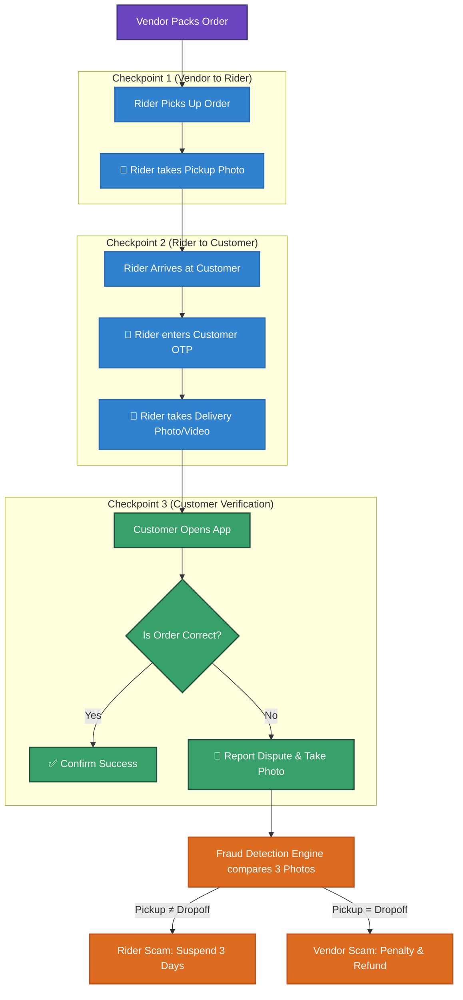
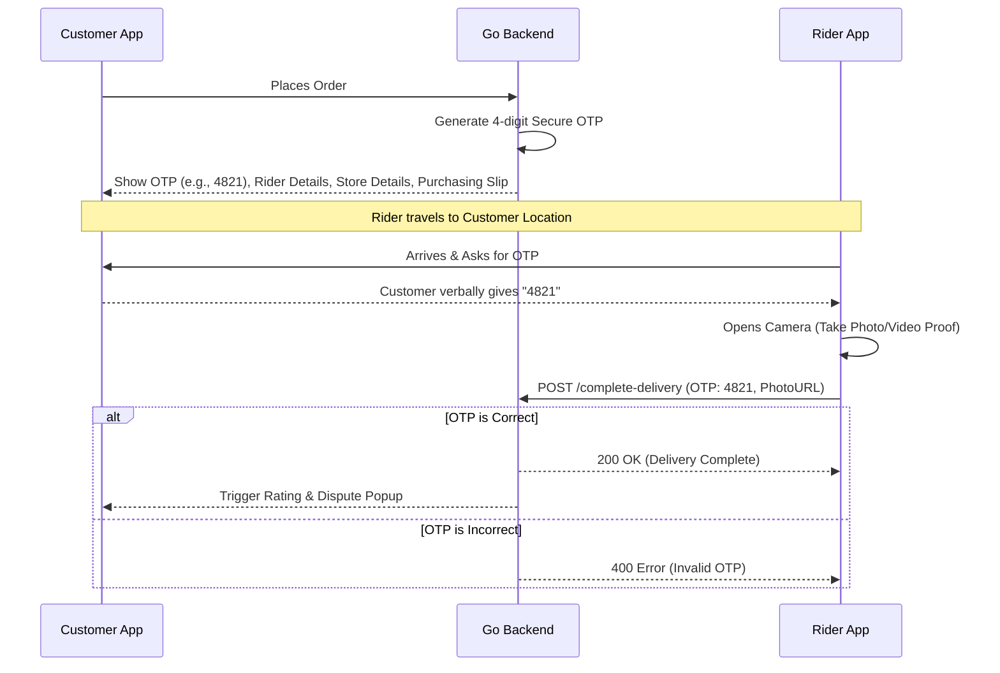
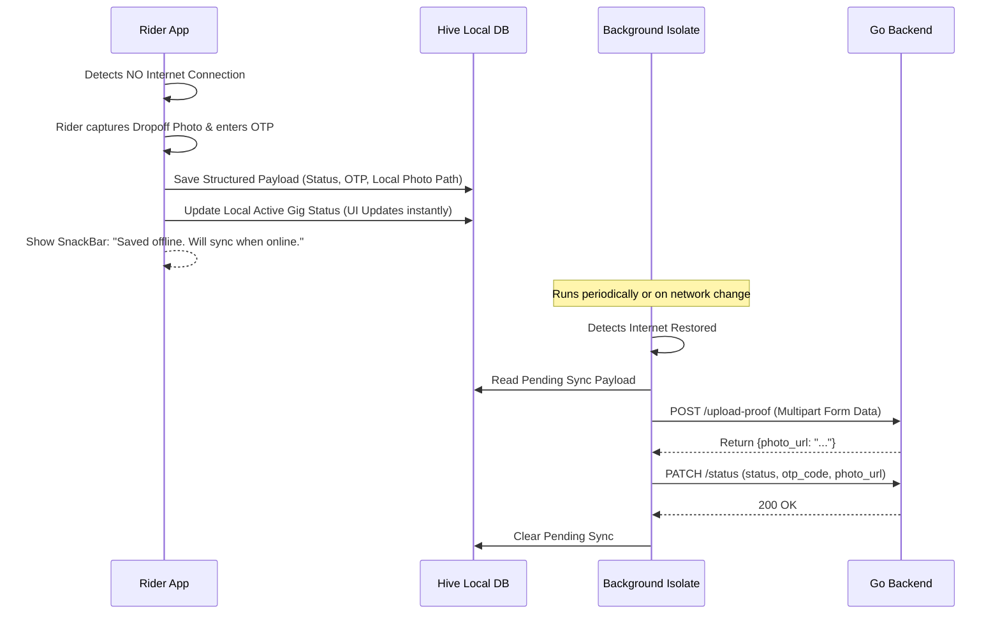

# OMNIGO Super App - Fraud Prevention & Proof of Delivery (PoD)

> [!TIP]
> **Obsidian Compatibility:** This document uses standard Mermaid.js syntax. You can copy and paste the code blocks below directly into any Obsidian note.

## 📋 5-Step Fraud Prevention Workflow

### 📥 Step 1: Order Placement (Customer End)
- **Order Confirmation:** Customer order place karega to us ke pass screen par ek unique Security OTP (Verification Code) show hoga.
- **Transparent Dashboard:** Customer ko Rider ki mukammal details (Naam, Photo, Gari ka number), Tracking ID, Store ki details, aur Digital Purchasing Slip real-time nazar aayegi.

### 📦 Step 2: Pickup Verification (Vendor End)
- **Mandatory Photo:** Rider jab store se parcel received karega, to chalne se pehle app me parcel ki photo upload karega taake proof ho ke vendor ne sahi cheez di thi.

### 🚲 Step 3: Offline Architecture (Rider End - Fluctuating Network)
- **Hive Local DB:** Jab rider customer ke ghar pahuchega aur internet nahi hoga (3G/4G down), to app local database (Hive) use karegi.
- **Local State Save:** Rider jaise hi "Mark Arrived" par click karega, ya OTP enter karega, wo data foran server par bhejne ke bajaye pehle phone ki storage me save ho jayega.
- **Background Sync Isolate:** Phone ke background me ek automatic service chalti rahegi. Jaise hi rider ka internet wapas aayega, yeh service bina app khole saara data server par push kar degi.

### 🤝 Step 4: Secure Delivery (Rider & Customer Meeting)
- **OTP & Media Proof:** Rider customer se wo Unique OTP maang kar apni app me dale ga. Saath hi rider parcel pakrate waqt product ki ek tasveer ya choti video banayega.
- **Instant Verification:** Customer ke pass bhi mauqa hoga ke wo on-the-spot cheez check kare aur app par "Confirm & Accept" click kar de.

### 🚨 Step 5: Dispute & Scam Resolution (Admin End)
- **Customer Report:** Agar product tooti hui ya nakli nikli, to customer foran "Report Issue" par click karke tasveer khinchega aur order reject ho kar vendor ko wapas chala jayega.
- **Fraud Investigation:** Agar Vendor daawa kare ke "Rider ne cheez badli hai", to Admin Panel automatically 3 cheezon ko aamne-saamne rakh kar check karega:
  1. Vendor se lete waqt ki photo.
  2. Customer ko dete waqt ki photo.
  3. Customer ki report photo.
- **Fair Action:** Agar Rider ka kasoor sabit ho jaye, to use 3-day Temporary Suspension aur warning mil jayegi. Agar customer ya vendor jhoot bol raha hoga, to rider safe rahega.

---

## 3-Way Photo Verification Engine Diagram

The **3-Way Photo Verification Engine** solves dispute resolution by enforcing photographic checkpoints:

---

## 🔑 OTP & State Lifecycle

---

## 📡 Offline Sync Architecture (Fluctuating Networks)

When the Rider is operating in areas with poor 3G/4G connectivity, the app falls back to a robust offline-first architecture using Hive.

---

## Technical Specifications

### Database Schema Updates (DeliveryGig)
- `otp_code` (string): Auto-generated 4-digit code.
- `pickup_photo_url` (string): Link to the photo taken at the vendor.
- `delivery_photo_url` (string): Link to the photo/video taken at the customer.
- `customer_dispute_photo_url` (string): Link to the photo taken by the customer if disputed.
- `dispute_status` (string): e.g. `none`, `disputed`, `resolved_rider_guilty`, `resolved_vendor_guilty`.

### Security Constraints
> [!WARNING] Gallery Upload Prevention
> The Rider app must strictly use the native device camera interface. Uploading from the phone's gallery will be disabled to prevent riders from uploading old/fake photos.

> [!IMPORTANT] Bandwidth Optimization
> Photos must be compressed natively on the Rider's phone (e.g., max 1080x1080 resolution, ~200KB size) before uploading. This ensures fast uploads even on spotty 3G/4G connections at doorsteps.
