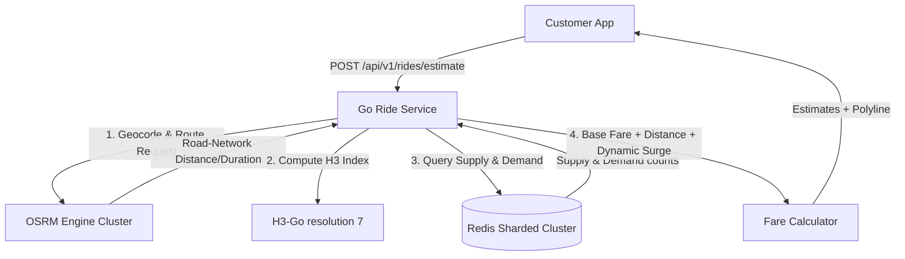

# OMNIGO Session 27 — Plan: OSRM Dynamic Routing & H3 Surge Pricing Engine

> **Obsidian Compatibility:** This document is recorded in the repo's `docs` directory so it renders inside Obsidian notes.

## Goal
Implement OSRM dynamic routing + multi-vehicle pricing engine (surge / H3 density) for the rider/customer apps.

---

## 📋 Technical Flow & Architecture



---

## 🔄 Dynamic Pricing Sequence Diagram

This diagram demonstrates how supply, demand, and OSRM coordinates interact to compute dynamic, real-time rates:

```mermaid
sequenceDiagram
    participant Customer App
    participant Ride API (Go)
    participant OSRM Engine
    participant Redis (H3 Cache)

    Customer App->>Ride API (Go): POST /api/v1/rides/estimate {pickup, dropoff}
    
    Ride API (Go)->>Redis (H3 Cache): GET route:ride:estimate:<origin_destination>
    alt Cache Hit
        Redis (H3 Cache)-->>Ride API (Go): Return Route Polyline, Distance, Duration
    else Cache Miss
        Ride API (Go)->>OSRM Engine: GET /route/v1/driving/{pickup};{dropoff}
        OSRM Engine-->>Ride API (Go): Return Route Details (Distance, Duration, Polyline)
        Ride API (Go)->>Redis (H3 Cache): SETEX route:ride:estimate (TTL 30s)
    end

    Ride API (Go)->>Ride API (Go): Map pickup to H3 Hexagon ID (Res 7)
    Ride API (Go)->>Redis (H3 Cache): INCR demand:h3:<hex_id> (TTL 5m)
    Ride API (Go)->>Redis (H3 Cache): GEORADIUS riders:locations:h3:<hex_id>
    Redis (H3 Cache)-->>Ride API (Go): Return available riders list (Supply)

    Ride API (Go)->>Ride API (Go): Calculate Surge Multiplier = 1.0 + (demand / supply) * 0.15
    Ride API (Go)->>Ride API (Go): Calculate fares for Bike, Rickshaw, and Car
    Ride API (Go)-->>Customer App: Return pricing lists, surge factors, and route geometry
```

---

## 🛠️ Step-by-Step Execution Plan

### Step 1: Database and Model Updates (Go)
1. Modify `internal/ride/models/ride.go` to add vehicle selection supporting `Bike`, `Rickshaw`, and `Car`.
2. Define the estimate output JSON formats (`VehicleEstimate` and `PricingEstimateResponse`) to bundle fares, ETAs, and road geometry lines.

### Step 2: H3 Supply & Demand Calculation (Redis)
1. **Supply Query:** Lookup available riders in the neighborhood of the pickup location (using current location keys in Redis, mapping to H3 resolution 7 cells).
2. **Demand Tracking:** Increment a sliding 5-minute bucket in Redis under `demand:h3:<hex>:<time>` on every request estimation to track dynamic customer demand.
3. **Surge Equation:** Calculate `multiplier = 1.0 + (demand / max(supply, 1)) * 0.15` (Capped at `3.0x`).

### Step 3: OSRM Route Calculations
1. Incorporate OSRM API requests inside `pricing_service.go` to resolve the actual road polyline coordinates, driving distance, and duration.
2. Store computed routing results temporarily in Redis cache under `route:ride:estimate:<origin_destination>` (TTL 30 seconds) to prevent redundant HTTP queries under high concurrency.
3. Implement Haversine mathematical distance fallback to ensure the app continues to estimate fares if the OSRM container experiences service disruptions.

### Step 4: Endpoints & Routing (Go)
1. Register `POST /api/v1/rides/estimate` inside `ride_handler.go`.
2. Create `pricing_service.go` to perform the matrix mathematics.

### Step 5: Flutter Frontend (Customer App UI)
1. Render a dynamic ride estimation sheet showing Bike, Rickshaw, and Car rates, ETAs, and surge multipliers.
2. Plot the OSRM geometry polyline on the Leaflet map overlay to preview the route for the customer before booking.

---

## 📏 Vehicle Pricing Matrix
- **Bike:** Base 50 PKR | 15 PKR/km | 2 PKR/min
- **Rickshaw:** Base 80 PKR | 25 PKR/km | 3 PKR/min
- **Car:** Base 150 PKR | 50 PKR/km | 5 PKR/min
